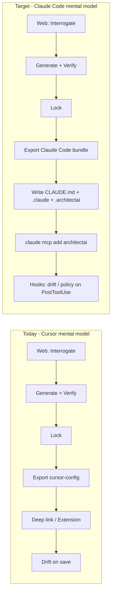

# ArchitectAI → Claude Code: Product Growth Pivot

**Role:** Product Growth Manager (Claude Code ecosystem)  
**Date:** 2026-06-03  
**Audience:** Founder, product, engineering  
**Context:** The product was conceived and built around **Cursor / VS Code** (deep links, extension, on-save drift). The growth opportunity is to be the **verification + governance layer for teams shipping architecture through Claude Code** — terminal-native, hook-driven, MCP-connected — not a generic “IDE export” add-on.

---

## 1. The insight you missed (and why it matters)

| What you built for | What Claude Code actually is |
|--------------------|------------------------------|
| GUI IDE with protocol handlers (`cursor://`, `vscode://`) | **Terminal agent** that reads/writes the repo and runs commands |
| Extension that runs **on save** in the editor | **Hooks** (`PostToolUse`, `SessionStart`) and **MCP** for deterministic side effects |
| `.cursorrules` / project docs as optional context | **`CLAUDE.md`** + `.claude/` as the **first-class** memory and config surface |
| “Export to IDE” as the last mile | **“Materialize verified baseline into the repo”** so every `claude` session inherits trust constraints |
| Drift = editor gutter + panel | Drift = **hook or MCP call** after edits, with results surfaced in terminal or a thin web dashboard |

**Growth thesis:** ArchitectAI’s moat (independent verification + spatial trust + continuity) is *more* valuable in Claude Code than in Cursor, because Claude Code users already delegate consequential edits to an agent. They need **ground truth before the agent acts**, not another diagram tool.

**Positioning shift:**

- **Before:** “Generate architecture → verify → export to your IDE.”
- **After:** “Verify architecture once in ArchitectAI → **stamp the repo** so Claude Code always codes against an independently verified baseline.”

---

## 2. Strategic repositioning (growth narrative)

### 2.1 Category

| Dimension | Cursor-era framing | Claude Code framing |
|-----------|-------------------|---------------------|
| Category | Architecture generator + IDE governance | **Trust layer for agentic engineering** |
| Hero user | Staff engineer in Cursor | Staff engineer running **`claude` in CI and locally** |
| Wedge | “Rich diagram + export” | “**Agent cannot ship unverified architecture** — manifest + hooks enforce it” |
| Distribution | VS Code marketplace + deep links | **Claude Code plugin / MCP + `claude mcp add`** |
| Proof point | Extension drift on save | **PostToolUse hook** + Trust Grade in `manifest.json` |

### 2.2 Personas (update `new_PRD_updated.md` §2)

Replace or supplement:

> **Developer (Cursor/VS Code)** — codes against a verified baseline; drift on save.

With:

> **Agentic developer (Claude Code)** — runs multi-step refactors in the terminal; needs **CLAUDE.md + hooks** so the agent respects verified boundaries, contracts, and ADRs without re-explaining every session.

> **Platform / DevEx lead** — rolls out `.claude/` + `.mcp.json` per repo from ArchitectAI export; measures Trust Grade and drift in dashboard, not in an editor panel.

### 2.3 Competitive story (for Claude Code users)

Anthropic optimizes **how** the agent works (models, tools, hooks). ArchitectAI optimizes **what** the agent is allowed to believe is true (requirements → verified architecture → repo rules). That is complementary, not competitive — position for **co-selling** via MCP and plugins, not “instead of Claude Code.”

---

## 3. Journey map: what changes for the user



| Step | Keep? | Change |
|------|-------|--------|
| Interrogation → Generation → Verification Pass | ✅ Yes | Copy: “feeds your **Claude Code project memory**, not just a diagram” |
| Workspace / lineage / lock gate | ✅ Yes | Unchanged — this is IDE-agnostic |
| IDE picker (VS Code / Cursor / Antigravity) | ⚠️ Deprioritize | Replace primary CTA with **“Set up Claude Code”** |
| Deep link handoff | ❌ Not primary | Claude Code has no `claude://connect` handoff; use **repo files + MCP OAuth/token** |
| `apps/cursor-extension` on-save drift | ⚠️ Secondary | Reimplement as **MCP tool + PostToolUse hook** (see §5) |
| Export format `cursor-config` | 🔄 Rename / split | **`claude-code-bundle`** (and keep `cursor-config` as legacy alias) |

---

## 4. Changes by product layer

### 4.1 Positioning & copy (web app)

**Files to update:** `LandingPage`, `ExportEducationModal`, `DriftLoopExplainer`, `export-artifacts-copy.ts`, `ProductJourneyMap`, PRD §3 diagram.

| Surface | Today | Change to |
|---------|-------|-----------|
| Export education | “IDE handoff”, “extension on save” | “**Claude Code setup**”: CLAUDE.md, hooks, MCP |
| Journey step 9–10 | “Export & IDE handoff”, “IDE drift govern” | “**Export to repo**”, “**Agent drift govern** (hooks)” |
| Primary export CTA | “Export to IDE” | “**Install in this repo (Claude Code)**” |
| Secondary CTA | — | “Legacy: VS Code / Cursor extension” (collapsed) |

**Acceptance:** First-time export flow shows a **3-step Claude Code checklist** (files written → MCP connected → hook enabled), not a deep-link copy field.

---

### 4.2 Export artifacts (core product change)

Today, MVP export centers on `cursor-config` JSON (`.architectai/*` + API endpoints for extension pull). For Claude Code, export must produce **repo-native** artifacts:

| Artifact | Purpose | Notes |
|----------|---------|--------|
| **`CLAUDE.md`** (generated section) | Always-on agent context: verified architecture summary, layer rules, “do not violate” list, Trust Grade, verification run id | Merge block under `## ArchitectAI verified baseline` — do not overwrite user’s full file; support `CLAUDE.local.md` pattern |
| **`.architectai/`** (unchanged) | Machine-readable manifest, rules, contracts, boundaries | Still source of truth for hooks/MCP |
| **`.claude/settings.json`** (fragment) | Register **PostToolUse** hook → `npx architectai-drift-hook` or curl to API | Hooks are how Claude Code **guarantees** drift checks (per Anthropic docs) |
| **`.mcp.json`** (project scope) | `architectai` MCP server: `verify_component`, `check_drift`, `get_manifest` | Teams commit this; `claude mcp add` from template |
| **`.claude/commands/architectai-review.md`** (optional) | Slash command: “Review changes against verified architecture” | Growth loop: habit in Claude Code |
| **`docs/adr-*.md`** | Human ADRs | Already in MVP — emphasize in Claude Code onboarding |

**Engineering touchpoints:**

- `apps/api/src/export/build-artifacts.ts` — add `bundleToClaudeCodeBundle()`
- `packages/shared` — new types: `ClaudeCodeBundle`, `ClaudeCodeExportFormat`
- `MVP_EXPORT_FORMATS` in `packages/config` — add `claude-code-bundle`; deprecate naming-only tie to Cursor
- `apps/api/src/export/render.ts` — render new format
- `apps/web` export wizard — default format **`claude-code-bundle`**, not `cursor-config`

**`CursorConfig` rename (technical debt):** Treat as **`AgentWorkspaceConfig`** (IDE-neutral). Cursor and Claude Code both consume the same manifest; only the **delivery mechanism** differs (extension pull vs file write + MCP).

---

### 4.3 Handoff & registration (replace deep-link centrism)

| Capability | Cursor/VS Code today | Claude Code target |
|------------|----------------------|-------------------|
| Workspace registration | `POST /api/cursor/workspaces`, local path, scoped token | **`POST /api/agent-workspaces`** (alias), repo id = git remote hash or user-provided path |
| Connect UX | `buildIdeDeepLink`, `IdePickerModal`, `ExportLaunchOverlay` | **“Copy setup script”**: `curl -fsSL …/install-claude-code.sh \| bash` or `npx @architectai/cli init` |
| Auth | Bearer token in deep link | **MCP OAuth** or **project-scoped API key** in `.architectai/credentials` (gitignored) + documented in `CLAUDE.md` |
| Session continuity | Extension WebSocket | MCP streaming + optional webhook from hook script |

**Files:** `apps/api/src/services/ide-handoff.service.ts`, `export-ide-handoff.service.ts`, `apps/web/src/lib/ide.ts`, `IdePickerModal.tsx` — add **`claude-code`** as `IdeTarget` or replace picker with **environment selector**: Claude Code (recommended) | VS Code extension | Cursor (legacy).

**Do not block launch on:** protocol handler support from Anthropic. **Do block on:** one-command repo materialization.

---

### 4.4 Drift & “govern” loop (extension → hooks + MCP)

Today: `apps/cursor-extension` — save listener, WS, `filesFromCursorConfigExport`.

**Claude Code equivalent (minimum viable):**

1. **MCP server** (`packages/mcp-architectai` or `apps/mcp-server`):
   - Tools: `architectai_check_file`, `architectai_report_drift`, `architectai_get_trust_grade`
   - Auth: workspace token from `.architectai/credentials`
2. **Hook** (documented in export bundle):
   - Event: `PostToolUse` (after Write/Edit)
   - Action: run CLI that POSTs file path + hash to ArchitectAI drift API
   - On violation: exit non-zero + stderr message Claude reads next turn
3. **Optional skill** (`.claude/skills/architectai-governance/SKILL.md`): when to call MCP tools, how to interpret conflicts

**Growth reason:** Hooks are **deterministic**; Claude Code users trust them for policy. Your PRD’s “drift on save” becomes “drift after every agent file write” — stricter and on-brand for v3 verification.

**Keep extension path** for teams still on Cursor; do not delete `apps/cursor-extension` until MCP+hook parity reaches same P95 target.

---

### 4.5 API & data model

| Item | Action |
|------|--------|
| `cursor_workspaces` table | Rename conceptually to `agent_workspaces`; add column `runtime: 'claude-code' \| 'vscode' \| 'cursor'` |
| Audit `cursor.workspace.connected` | Add `agent.workspace.connected` with `runtime` payload |
| OpenAPI tag “Cursor” | Split: **“Agent runtime”** + deprecate Cursor-only wording in `docs/04_ARCHITECTAI_API_SPEC.yaml` |
| `GET /cursor/workspaces/{id}/config` | Keep alias; add `GET /agent/workspaces/{id}/bundle` returning full Claude Code file map |

---

### 4.6 LLM strategy (subtle but important for growth)

You already use Anthropic for generation. For Claude Code positioning:

- **Interrogation / verification copy** should say “compatible with Claude Code project memory” — not “built for Cursor.”
- **Do not** compete with Claude on codegen; compete on **verification gating** before codegen starts.
- **Partnership narrative:** “ArchitectAI verifies; Claude Code implements” — reduces risk Anthropic sees you as a fork.

Optional later: **Claude Code plugin** packaging skills + hooks + MCP (`.claude-plugin` marketplace) for one-click install — highest leverage distribution.

---

## 5. Go-to-market (Claude Code–specific)

### 5.1 Launch sequence (recommended)

| Phase | Deliverable | Success signal |
|-------|-------------|----------------|
| **P0** | `claude-code-bundle` export + docs | User can run `claude` in repo and see verified rules in context |
| **P1** | MCP server + `claude mcp add` docs | 50% of exports enable MCP within 7 days |
| **P2** | PostToolUse drift hook CLI | Drift events per active workspace/week |
| **P3** | Plugin marketplace listing | Installs via Anthropic plugin directory |
| **P4** | CI: `architectai verify` on PR (headless) | Enterprise pipeline adoption |

### 5.2 Messaging pillars

1. **“Verified baseline in CLAUDE.md”** — not “export config.”
2. **“Hooks enforce what prompts cannot”** — drift and lock violations block silently-failed agent edits.
3. **“MCP connects live Trust Grade”** — agent queries manifest before large refactors.
4. **“Same verification engine, any runtime”** — Cursor extension becomes optional lane.

### 5.3 Channels

- Claude Code docs cross-link (MCP catalog, hooks examples) — apply when bundle is stable
- Template repo: `anthropics/architectai-starter` or your org’s public template with pre-wired `.mcp.json`
- Content: “How to stop Claude from inventing services” (verification pass as hero)
- Enterprise: audit log + manifest stamp for regulated buyers (unchanged, stronger with hook evidence)

---

## 6. What to keep vs stop doing

### Keep (core IP)

- Verification Pass (deterministic + probabilistic)
- Decision Lineage + workspace canvas
- Lock gate + override audit
- `.architectai/manifest.json` stamp (verification run id, Trust Grade)
- Web app as **system of record** for architecture truth

### Deprioritize (Cursor-first assumptions)

- Deep link as **primary** export completion metric
- VS Code as **default** `DEFAULT_IDE_TARGET` (`packages/shared/src/ide.ts`)
- `IdePickerModal` “Recommended: Visual Studio” first
- Marketing in `docs/00_CURSOR_USAGE_GUIDE.md` as primary onboarding
- Naming everything `cursor-*` in DB and APIs for new features

### Stop (anti-patterns for Claude Code GTM)

- Requiring a GUI IDE step to get value
- Assuming on-save editor events exist
- Competing with Claude Code on “agent intelligence”
- Shipping only JSON blob without writing `CLAUDE.md` (users will not manually merge)

---

## 7. Engineering backlog (prioritized)

| Priority | Work item | Est. impact |
|----------|-----------|-------------|
| P0 | New export format `claude-code-bundle` (CLAUDE.md + `.claude` hooks stub + `.mcp.json` template) | Unblocks all GTM |
| P0 | Web export UX: Claude Code setup wizard replaces IDE picker default | Conversion |
| P0 | CLI `architectai init` writes bundle into cwd, registers MCP | Reduces friction vs deep link |
| P1 | MCP server package with drift + manifest tools | Native Claude Code integration |
| P1 | Hook script + API endpoint optimized for PostToolUse (fast, &lt;200ms P95) | “Govern” loop parity |
| P2 | Rename `CursorConfig` → `AgentWorkspaceConfig` + API aliases | Clarity, less rework later |
| P2 | `agent_workspaces.runtime` + analytics | Growth metrics by runtime |
| P3 | Claude Code plugin (skills + hooks + MCP bundled) | Distribution |
| P3 | Headless `architectai verify` for CI | Enterprise |

---

## 8. Metrics (growth manager scorecard)

| Metric | Cursor-era | Claude Code-era |
|--------|------------|-----------------|
| Activation | Extension connected | **`claude mcp` connected** OR hook script present in repo |
| Time-to-value | Deep link opened | **First `claude` session** with CLAUDE.md baseline loaded |
| Retention | Weekly saves with drift checks | **Weekly PostToolUse drift checks** per workspace |
| Expansion | Re-export after architecture change | **Manifest version bump** + hook re-run success |
| Revenue narrative | “IDE seats” | “**Verified repos**” / “**agent-governed** projects” |

Instrument: export format chosen, `runtime` on workspace row, MCP health ping, hook callback volume.

---

## 9. Risks & mitigations

| Risk | Mitigation |
|------|------------|
| Anthropic ships native “architecture memory” | Double down on **independent verification** + Trust Grade — not memory, **proof** |
| Hooks scare enterprise (arbitrary scripts) | Ship signed, read-only `npx @architectai/drift-hook` with pinned version |
| Users overwrite generated `CLAUDE.md` | Merge strategy + `architectai sync` CLI to refresh section |
| Split brain (Cursor + Claude Code) | One manifest, multiple runtimes; document clearly in export |
| Old E2E/tests tied to `ide=cursor` | Add `e2e/claude-code-export.spec.ts`; keep legacy suite as `gate:legacy-ide` |

---

## 10. Immediate next steps (this week)

1. **Product:** Add this doc to planning; amend PRD §3 diagram footnote: “Agent runtime (Claude Code primary).”
2. **Design:** Wireframe “Claude Code setup” export screen (3 steps, no deep link).
3. **Engineering:** Spike `claude-code-bundle` generator from existing `buildArchitectAiBundle()`.
4. **Growth:** Draft MCP server README with `claude mcp add` one-liner for beta users.
5. **Legal/partnerships:** Confirm Anthropic trademark usage (“Claude Code”) in marketing; plan plugin listing requirements.

---

## 11. Reference: Claude Code primitives to map ArchitectAI features

| Claude Code primitive | ArchitectAI feature |
|----------------------|---------------------|
| `CLAUDE.md` | Verified architecture summary + governance “always on” rules |
| `.claude/settings.json` hooks | Drift check after agent writes |
| `.mcp.json` | Live manifest, Trust Grade, verification API |
| Skills | “How to interpret conflicts / overrides” |
| Slash commands | `architectai-review`, `architectai-sync` |
| Plugins (marketplace) | Packaged distribution of the above |
| Subagents (optional) | Heavy verification explainers without bloating main session |

---

## 12. File index (where Cursor assumptions live today)

Use this as a migration checklist:

| Area | Paths |
|------|--------|
| IDE targets & deep links | `packages/shared/src/ide.ts`, `apps/web/src/lib/ide.ts` |
| Export formats | `packages/config`, `apps/api/src/export/`, `apps/web/src/pages/ExportWizardPage.tsx` |
| Handoff services | `apps/api/src/services/export-ide-handoff.service.ts`, `ide-handoff.service.ts` |
| Extension / drift | `apps/cursor-extension/` |
| Web UX | `IdePickerModal.tsx`, `ExportLaunchOverlay.tsx`, `export-artifacts-copy.ts` |
| PRD / docs | `new_PRD_updated.md`, `docs/00_CURSOR_USAGE_GUIDE.md`, `docs/04_ARCHITECTAI_API_SPEC.yaml` |
| Tests | `apps/web/e2e/*export*`, `apps/web/e2e/ide-native-export.spec.ts` |

---

**Bottom line:** You do not need to throw away the verification-gated web loop. You need to change the **last mile** from “launch an IDE” to **“make Claude Code’s session inherit an independently verified baseline — via files, hooks, and MCP.”** That is the product your Claude Code growth story should sell.

---

## Implementation status (2026-06-03, updated)

| Item | Status |
|------|--------|
| `claude-code-bundle` export format | ✅ `packages/shared`, `apps/api/src/export` |
| `claude-code` IdeTarget + default | ✅ `packages/shared/src/ide.ts` |
| Claude Code setup modal (web) | ✅ `ClaudeCodeSetupModal.tsx` |
| Legacy IDE picker (collapsed path) | ✅ `IdePickerModal` + `gate:legacy-ide` |
| `@architectai/runtime-client` | ✅ credentials, manifest, drift API, apply-bundle |
| `@architectai/drift-hook` | ✅ PostToolUse CLI (strict + `--soft`) |
| `@architectai/cli` | ✅ `architectai init` / `apply-bundle` |
| MCP server (manifest + drift tools) | ✅ `apps/mcp-server` uses runtime-client |
| `/api/agent/*` aliases | ✅ `apps/api/src/routes/agent.route.ts` |
| DB migration `0002_claude_code.sql` | ✅ (run on Postgres) |
| Operator guide | ✅ `docs/claude-code-setup.md` |
| Tests | ✅ unit + `phase-claude-runtime.test.ts` + `gate:claude-code` E2E |
| Gates | ✅ `gate:claude-runtime`, `gate:claude-code-full`, `gate:legacy-ide` |

**Not yet (P2/P3):** npm publish, `AgentWorkspaceConfig` rename, `runtime` DB column, Claude Code plugin marketplace, CI `architectai verify`.

**Verify locally:**

```bash
pnpm gate:claude-runtime
pnpm gate:claude-code-full   # + Playwright (E2E API on :4001)
```
