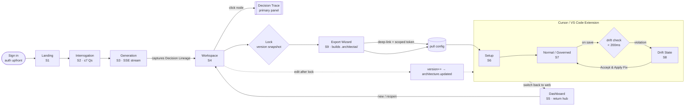
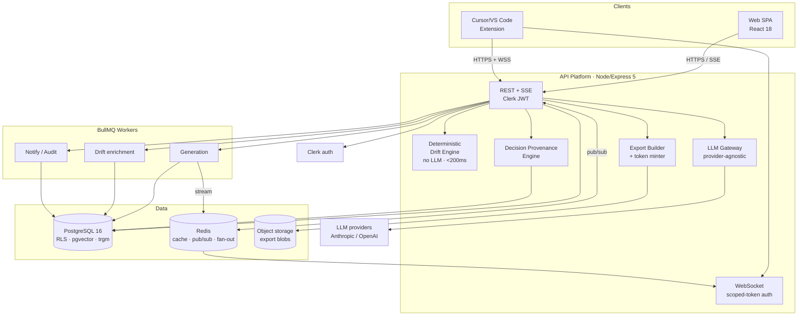
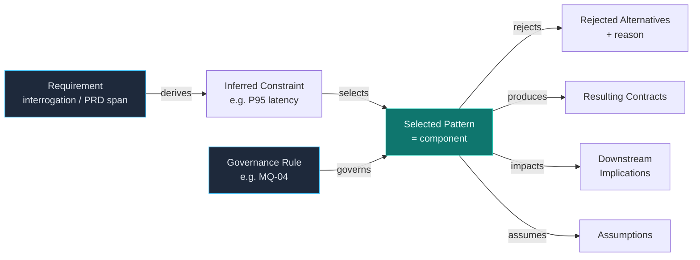
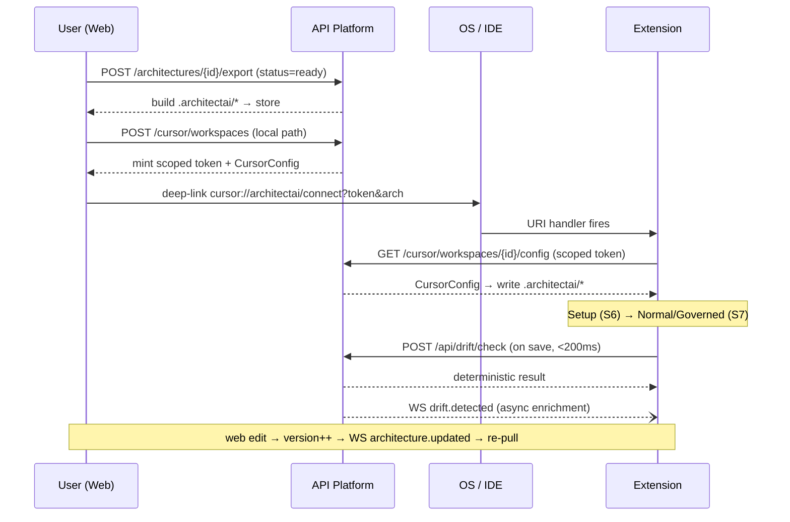

# ArchitectAI — Diagrams (Validation View)

**Version:** 1.0
**Date:** 2026-05-29
**Companion:** `new_PRD.md` · `new_architecture.md` · `IMPLEMENTATION_PLAN.md`

> Simple Mermaid views to validate the application before building. These mirror the
> closed-loop model in `new_PRD.md §3`, the topology in `new_architecture.md §5`, and the
> Decision Provenance Engine. GitHub/most Markdown viewers render Mermaid inline.

---

## 1. The Core Product Loop (user experience)

*Create & lock in Web → export/hand-off to IDE → govern & detect drift → return to Dashboard.*

---

## 2. System Topology (how it's built)

*Deterministic drift hot path off the LLM path; LLM enrichment async via WebSocket.*

---

## 3. Decision Lineage — Flagship Causal Chain (per component)

*Every `source.ref` is referentially checked server-side before display (anti-hallucination guard).*

---

## 4. Web↔IDE Bridge — Sequence (deep-link hand-off)

---

*Source of truth for behavior remains `docs/01–05` + the spec deltas in `new_architecture.md §10.1`.*
