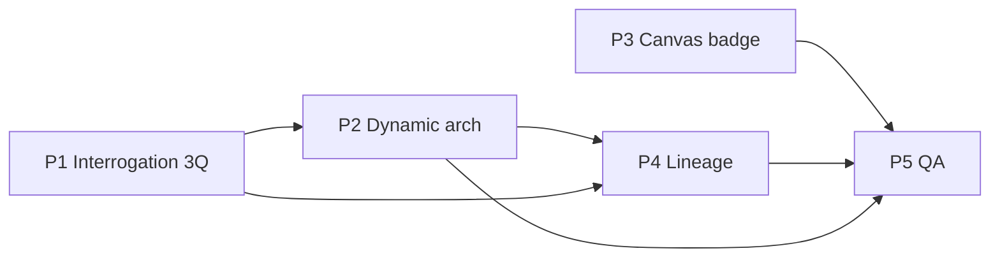

# Minimum Satisfaction Implementation Plan

**Version:** 1.0  
**Date:** 2026-06-02  
**Trigger:** Manual E2E testing with real Anthropic LLM (local staging)  
**Goal:** Address four blocking UX/product gaps before L4 production hardening.

---

## Executive summary

| # | User pain | Root cause (code) | Phase |
|---|-----------|-------------------|-------|
| 1 | Interrogation too slow between questions | Synchronous LLM call on every `answer`/`skip`; up to **7** questions (`INTERROGATION.maxQuestions`) | **P1** |
| 2 | Architecture diagram always looks the same | Hardcoded **connections**, **canvas positions**, mock **3-service template**; lineage not driving layout | **P2** |
| 3 | Verification icon overlaps component name | Verdict badge at `left-1.5 top-1.5` in `ArchitectureCanvas.tsx` | **P3** |
| 4 | Lineage / causal chain not meaningful | `buildGenerationPlanFromSeeds` emits generic nodes (`"Interrogation answer"`, `"Operational constraint"`) | **P4** |

**Recommended order:** P3 (quick win) → P1 (unblocks daily use) → P2 + P4 (same generation pipeline; ship together) → P5 (gates).

**Target outcome:** A user can complete **3 high-signal questions** in under ~2 minutes perceived wait, see a **domain-specific** architecture graph, read **actionable** decision traces, and see **verification badges** without layout clashes.

---

## Current behavior (evidence)

### 1. Interrogation latency

- `answerQuestion` / `skipQuestion` call `generateNextQuestion` → `generateQuestionPayload` → **one Anthropic Messages API round-trip per question** (`interrogation.service.ts`).
- Session completes only after **`INTERROGATION.maxQuestions` (7)** resolved (`packages/config/src/index.ts`).
- UI blocks the option grid while `loading` (`InterrogationPage.tsx` — `optionsDisabled` during API wait).
- L2 smoke: **~14s** first question, **~83s** full interrogate phase per scenario.

### 2. Repetitive architecture

- LLM blueprint (`generation.plan_v1`) returns service names/layers only (`generation-plan.ts` schema: 3–8 services, no edges).
- `persistGenerationResult` always wires **the same 3 connection specs** (REST → Kafka → gRPC loop) and **grid positions** `canvasX: 100 + i*160` (`persist.ts`).
- `buildGenerationPlanFromSeeds` / mock fallback use **api-gateway / payment-service / auth-service** template (`mock-plan.ts`).
- Service `rationale` persisted as `"Mock generation"` (`persist.ts`).

### 3. Verification badge placement

```65:76:apps/web/src/components/workspace/ArchitectureCanvas.tsx
      {data.showVerdictBadge && data.verdict ? (
        <span
          className={`absolute left-1.5 top-1.5 rounded px-1 ...`}
```

Label renders at top of node (`<p className="truncate font-medium">`) — collides with left badge. Tier icon already uses **top-right**.

### 4. Meaningless lineage

```71:78:apps/api/src/generation/mock-plan.ts
      {
        id: reqId,
        type: "requirement",
        label: "Interrogation answer",
        detail: "Derived from adaptive interrogation",
        source: { kind: "interrogation", ref: svc.requirementQuestionId, confidence: 88 },
      },
```

UI shows `node.label` / `node.detail` in `DecisionTracePanel.tsx` — not resolved to question text + chosen option. Chain always includes empty **Rejected alternatives** / **Assumptions** steps. Summaries are generic: `"${displayName} chosen for scale and governance fit"`.

---

## Phase P1 — Interrogation: fewer questions + faster perceived flow

### Objectives

- Cap interrogation at **3 essential questions** (product decision: quality over breadth).
- Cut **wall-clock wait** between answers via prefetch and/or batch generation.
- Keep Phase H rule: generation only after all configured questions are resolved.

### Tasks

| ID | Task | Area | Files (primary) |
|----|------|------|-----------------|
| P1-1 | Set `INTERROGATION.maxQuestions = 3`, `minQuestions = 3`; align generation gate | Config | `packages/config/src/index.ts`, `apps/api/src/services/generation.service.ts` |
| P1-2 | Update interrogation prompt: “exactly 3 questions”, ordered by impact (scale → security/compliance → integration) | AI | `apps/api/src/ai/prompts/interrogation.ts` |
| P1-3 | **Batch question plan** at `start`: new prompt `interrogation.plan_v1` returns Q1–Q3 JSON; persist all rows `pending`; serve Q2/Q3 from DB without LLM on answer | API | New schema/prompt; `interrogation.service.ts` (`startSession`, `answerQuestion`) |
| P1-4 | **Fallback** if batch fails: keep current per-answer LLM path but respect max 3 | API | `interrogation.service.ts` |
| P1-5 | **Prefetch** (optional enhancement): after Q1 shown, background-fetch validate Q2 text only if not using batch | API | Worker or fire-and-forget in controller |
| P1-6 | UX: optimistic transition — show skeleton + “Preparing next question…”; don’t dim entire grid for >300ms | Web | `InterrogationPage.tsx`, new `QuestionSkeleton.tsx` |
| P1-7 | Reduce interrogation `max_tokens` / tighten prompt size (answered summary cap) | AI | `anthropic.ts`, `interrogation.service.ts` |
| P1-8 | Update E2E helpers (`answerInterrogationQuestions` count), step dots copy | Web/E2E | `apps/web/e2e/helpers.ts`, `InterrogationPage.tsx`, `complete-flow.spec.ts` |

### Acceptance criteria

- [ ] Full interrogation (3 Q) completes in **≤ 45s P95** on Sonnet-class model (local staging).
- [ ] No LLM call on answer for Q2/Q3 when batch plan succeeded (verify via logs / `__dev__/llm-metering` delta).
- [ ] `pnpm gate:verification-e2e` and `complete-flow` green with 3-question flow.

### Risks / decisions

| Decision | Recommendation |
|----------|----------------|
| 3 vs 7 questions | **3** per your requirement; document in PRD |
| Batch vs prefetch only | **Batch at start** gives largest win; prefetch is backup |

---

## Phase P2 — Dynamic architecture generation

### Objectives

- Architecture **topology** (services, layers, **connections**, layout) derived from **initial prompt + interrogation answers**, not templates.
- No silent fallback to mock 3-service plan when `LLM_PROVIDER=anthropic` (surface error or retry).

### Tasks

| ID | Task | Area | Files (primary) |
|----|------|------|-----------------|
| P2-1 | Extend blueprint schema: `connections[]` (from, to by name, protocol, auth), optional `layoutHint` per service | AI | `apps/api/src/ai/schemas/generation-plan.ts` |
| P2-2 | Rewrite `GENERATION_PLAN_PROMPT`: domain-specific components, min 4 max 10 services, must reference user requirements by id/category; forbid generic gateway/payment/auth unless relevant | AI | `apps/api/src/ai/prompts/generation-plan.ts` |
| P2-3 | `buildGenerationPlanFromSeeds`: map LLM connections by service **name** → UUID; **no** fixed `connectionSpecs` | API | `mock-plan.ts`, `persist.ts` |
| P2-4 | Layout engine: layer swimlanes + auto-place nodes (dagre or simple column-by-layer); use LLM `layer` + connection graph | API/Web | New `generation/layout.ts`; optional `persist` coords |
| P2-5 | Persist LLM `rationale` per service; remove `"Mock generation"` | API | `persist.ts`, runner |
| P2-6 | Fail-closed: if anthropic plan fails, return 503 with message — do not `buildMockGenerationPlan` | API | `generation/runner.ts` |
| P2-7 | Pass structured **requirements digest** (prompt + Q/A labels) not only `answeredSummary` indices | API | `runner.ts`, new `generation/requirements-digest.ts` |
| P2-8 | Golden tests: 3 fixture prompts → assert distinct service **name sets** | Test | `apps/api/test/generation/` |

### Acceptance criteria

- [ ] Two different initial prompts (e.g. payments vs IoT) produce **different** service names and **≥1** different connection edge (same ruleset).
- [ ] Canvas has **≥4** services for complex prompts when LLM returns them.
- [ ] No hardcoded triangle connection loop in `persist.ts` for new generations.

### Dependencies

- P1 complete (3 answers feed richer but shorter digest).

---

## Phase P3 — Verification badge layout (quick fix)

### Objectives

- Verification indicator **top-right** of each node; **no overlap** with `displayName`.

### Tasks

| ID | Task | Area | Files (primary) |
|----|------|------|-----------------|
| P3-1 | Move verdict badge to `right-1.5 top-1.5`; add `pr-6` / reserved header row for label | Web | `ArchitectureCanvas.tsx` (`ServiceNode`) |
| P3-2 | Move tier `AlertCircle` to `right-1.5 bottom-1.5` (or hide when verdict badge shown) | Web | `ArchitectureCanvas.tsx` |
| P3-3 | Show ✅ for `verified` as small top-right dot (optional) or border-only per design | Web | `canvas.ts`, `ServiceNode` |
| P3-4 | Playwright: assert badge bounding box does not intersect label text | E2E | `verification-workspace.spec.ts` or new canvas spec |

### Acceptance criteria

- [ ] Manual: conflict ⚠/❌ visible top-right; full service name readable.
- [ ] E2E screenshot or bbox assertion passes.

### Dependencies

- None (can ship first).

---

## Phase P4 — Meaningful decision lineage & causal chain

### Objectives

- Requirements show **human text** (question + chosen option), not `"Interrogation answer"`.
- Causal chain includes **specific** constraints, alternatives, rules, implications — or **hides** empty sections.
- Verification / lineage graph layers do not surface low-value boilerplate.

### Tasks

| ID | Task | Area | Files (primary) |
|----|------|------|-----------------|
| P4-1 | New LLM workload `lineage.enrich_v1` OR extend generation blueprint with per-service `lineage` block (requirements, constraints, alternatives, assumptions, summary) | AI | New prompt/schema; `gateway.ts` routing |
| P4-2 | Replace `buildGenerationPlanFromSeeds` lineage stub with LLM output; map `source.ref` to real question IDs | API | `mock-plan.ts` → rename `plan-builder.ts` |
| P4-3 | Requirement nodes: `label` = truncated question; `detail` = selected option label/text from DB | API | `plan-builder.ts` + load questions in runner |
| P4-4 | Include **initial prompt** as `prd-span` requirement node on every trace | API | `plan-builder.ts` |
| P4-5 | `resolveDecisionTrace` / UI: enrich interrogation sources with `questionText` + answer (new fields on `ResolvedLineageNode`) | API/Web | `lineage-read.service.ts`, `DecisionTracePanel.tsx`, `LineageDecisionNode.tsx` |
| P4-6 | Hide chain steps with zero nodes (don’t render “Rejected alternatives” accordion) | Web | `DecisionTracePanel.tsx` |
| P4-7 | Rewrite `buildDecisionNarrative` to use enriched labels; drop boilerplate paragraphs | API | `decision-narrative.ts` |
| P4-8 | Lineage graph: filter node types with no detail; style requirement nodes with Q/A | Web | `LineageGraphView.tsx`, `LineageGraphStage.tsx` |
| P4-9 | Critical decisions / topics: rank by specificity not generic labels | API | `rank-critical-decisions.ts` |
| P4-10 | Verification findings panel: link findings to service displayName, not raw IDs | Web | `VerificationFindingsSection.tsx` |

### Acceptance criteria

- [ ] Clicking any service shows ≥1 requirement with **actual question text** and **answer label**.
- [ ] No visible node labeled exactly `"Interrogation answer"` or `"Derived from adaptive interrogation"`.
- [ ] Causal chain has **≤5** expanded steps; empty steps omitted.
- [ ] Summary mentions **specific** technology/driver (e.g. “Kafka for 10k RPS async fraud pipeline”), not “scale and governance fit” only.

### Dependencies

- **P2** (LLM generation path must produce lineage payload; shared generation transaction).

---

## Phase P5 — Integration, regression, documentation

### Objectives

- Prove minimum satisfaction with automated + manual gates; update operator docs.

### Tasks

| ID | Task | Area |
|----|------|------|
| P5-1 | Update `L2_FUNCTIONAL_TEST_MATRIX.md` for 3-question flow | Docs |
| P5-2 | Add `pnpm gate:min-satisfaction` = P3 E2E + generation fixture tests + 1 L2 scenario | CI |
| P5-3 | Re-run `pnpm eval:l2:functional` (1 scenario) on anthropic | Ops |
| P5-4 | Update `model_selection_scorecard.md` latency row (3 Q target) | Docs |
| P5-5 | README “Manual E2E” section: expected timings | Docs |

### Acceptance criteria

- [ ] `gate:min-satisfaction` green in CI (mock LLM).
- [ ] Manual sign-off checklist completed (below).

---

## Cross-phase dependency diagram



---

## Effort estimate (engineering)

| Phase | Effort | Can parallelize |
|-------|--------|-----------------|
| P3 | 0.5 day | Yes — start immediately |
| P1 | 2–3 days | After P3 |
| P2 | 3–4 days | With P4 design |
| P4 | 3–4 days | After P2 schema stable |
| P5 | 1 day | End |

**Total:** ~8–12 dev days for one engineer; P3 + P1 first week delivers most perceived improvement.

---

## What you need to do (product / ops)

| Item | Owner | When |
|------|-------|------|
| Approve **3-question** cap (vs 5/7 compromise) | Product | Before P1-1 |
| Approve **batch-at-start** UX (user waits once at beginning for Q1–Q3 plan) | Product | Before P1-3 |
| Spot-check 3 diverse prompts after P2 (payments, healthcare, IoT) | You | After P2 |
| Review lineage traces for “would I trust this?” | You | After P4 |
| Confirm verification badge design (top-right ⚠/❌ only vs ✅ dot) | Design/You | Before P3 merge |
| Re-run local staging E2E | You | After P5 |

---

## What engineering (agent) implements

Execute phases **P3 → P1 → P2 → P4 → P5** in order unless you request P3+P1 in parallel.

Do **not** start L4 production deploy until this plan’s P5 manual checklist is signed.

---

## Manual sign-off checklist (minimum satisfaction)

- [ ] 3 interrogation questions feel fast enough (< 1 min total typical)
- [ ] Architecture diagram clearly reflects my written requirements
- [ ] Verification symbol readable on every node
- [ ] Decision trace explains **why** with specific requirements, not placeholders
- [ ] Lock → export still works; verification gates unchanged

---

## Out of scope (this plan)

- Hosted cloud staging (L4)
- Candidate B/C model eval (L3)
- IDE extension / drift E2E
- Streaming generation UX (separate LLM-5 track)

---

## Reference files index

| Concern | Path |
|---------|------|
| Question count config | `packages/config/src/index.ts` |
| Per-answer LLM | `apps/api/src/services/interrogation.service.ts` |
| Generation LLM + fallback | `apps/api/src/generation/runner.ts` |
| Template lineage | `apps/api/src/generation/mock-plan.ts` |
| Hardcoded graph edges | `apps/api/src/generation/persist.ts` |
| Canvas node UI | `apps/web/src/components/workspace/ArchitectureCanvas.tsx` |
| Trace panel | `apps/web/src/components/workspace/DecisionTracePanel.tsx` |
| Interrogation UI | `apps/web/src/pages/InterrogationPage.tsx` |
