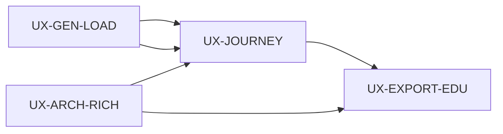

# UX Enhancement Plan — Loading, Rich Architecture, Export Education, Journey Map

**Version:** 1.0  
**Date:** 2026-06-03  
**Status:** Implemented (v1.1 — tests & edge cases, 2026-06-03)  
**PRD anchor:** `new_PRD_updated.md` §3 (verification-gated loop)  
**Baseline:** Local staging with Anthropic (`LLM_PROVIDER=anthropic`), existing `GenerationExperience`, `ExportLaunchOverlay`, workspace + verification streams

---

## Summary

| Track | Goal | Primary surfaces | Gate |
|-------|------|------------------|------|
| **UX-GEN-LOAD** | Visible progress from “Generate Architecture” through architecture + verification | Landing, Interrogation, Generation overlay | `gate:ux-gen-load` |
| **UX-ARCH-RICH** | Production-like diagrams (gateway, services, cache, DB, messaging, security) | API generation blueprint + canvas layout | `gate:ux-arch-rich` |
| **UX-EXPORT-EDU** | Educate before export: artifacts, IDE handoff, drift loop | Export wizard, IDE picker, launch overlay | `gate:ux-export-edu` |
| **UX-JOURNEY** | Persistent navigation map of full trust loop (lineage + dual verification) | App shell, first-run coach marks | `gate:ux-journey` |

**Recommended order:** UX-GEN-LOAD → UX-ARCH-RICH (parallel API prompt work) → UX-JOURNEY → UX-EXPORT-EDU  
**Ship gate:** `pnpm gate:ux-enhancements` = all four gates + `gate:chg` regression

---

## Current state (gaps)

### 1. Loading feedback

| Moment | Today | Gap |
|--------|-------|-----|
| Landing **Generate Architecture** | Button `loading` spinner only during `POST /interrogate/start` | No staged progress; user may think “architecture” is generating (it is only starting interrogation) |
| After Q3 answered | Text: “All questions answered — preparing your architecture…” | No bar/timer until `GenerationOverlay` mounts and SSE connects |
| Generation overlay | `GenerationExperience` has progress bar **only after first SSE `progress` event** | Dead zone: spinner in dashed box (`generation-loading-art`) while LLM plans blueprint |
| Verification | Shown inside overlay after generation `complete` | Deterministic vs probabilistic lanes not visually distinguished |

### 2. Architecture richness

| Layer | Prompt (`generation-plan.ts`) | Schema | Fallback (`seedsFromMockDomain`) |
|-------|------------------------------|--------|----------------------------------|
| gateway, services, security, database, messaging | “4–10 services” (soft) | `min(3)` services | Default template has **5** services, **no dedicated cache/CDN** |
| cache | Supported in schema | Optional | Rarely emitted |

**Observed “3 components”:** Likely LLM returning minimum schema (3) or canvas viewport showing subset before stream completes. Anthropic failures fall back to domain seeds (5 nodes) — user on real LLM may see sparse blueprints.

### 3. Export education

- `ExportLaunchOverlay` = procedural steps (lock → export → handoff → IDE).
- Missing: **what** `.architectai/*` contains, **why** lock/verification stamp matters, **how** drift detection works post-handoff.

### 4. Journey navigation

- No cross-screen map tying: Interrogate → Generate → **Verify (deterministic + probabilistic)** → Workspace/Lineage → Lock → Export → IDE drift.
- PRD v3 loop exists in docs only.

---

## Track UX-GEN-LOAD — Generation & verification loading UX

### Design decisions

1. **Honest copy:** Landing CTA starts **interrogation**, not architecture generation. Progress labels must say “Starting session” / “Loading questions”, not “Generating architecture”.
2. **Optimistic staged progress** before SSE: use client-side phase machine with time-based floor (not fake 100%) until first server `progress` event.
3. **Single overlay** for architecture + verification (extend `GenerationExperience`, do not add a second modal).
4. **Dual-lane verification UI:** Deterministic block (&lt;2s, icon ⚡) then probabilistic stream (icon 🔍).

### Implementation tasks

#### Web (`apps/web`)

| ID | Task | Files |
|----|------|-------|
| L-01 | `LandingProgressSheet` — bottom sheet or inline strip under CTA: steps `auth` → `session` → `first-question` → `navigate` | `LandingPage.tsx`, `LandingHero.tsx`, **new** `components/landing/LandingProgressSheet.tsx` |
| L-02 | Wire `runGenerate`: set `progressStep` before/after `startInterrogation`; min display 400ms to avoid flash | `LandingPage.tsx` |
| L-03 | `InterrogationPreparingBanner` — indeterminate bar + rotating messages while `startGeneration` in flight and before `overlayArchitectureId` | `InterrogationPage.tsx`, **new** `components/interrogation/PreparingArchitectureBanner.tsx` |
| L-04 | `useOptimisticGenerationProgress` — phases: `planning` (0–15%), `governance` (15–25%), `streaming` (follow SSE), cap at 95% until `complete` | **new** `hooks/useOptimisticGenerationProgress.ts`, `GenerationExperience.tsx` |
| L-05 | Replace spinner-only `generation-loading-art` with mini canvas skeleton + phase label + ETA “Typically 20–40s with live models” | `GenerationExperience.tsx` |
| L-06 | `VerificationProgressLanes` — two rows: deterministic (checklist): schema, refs, rules; probabilistic: streaming findings count | **new** `components/generation/VerificationProgressLanes.tsx`, `GenerationExperience.tsx` |
| L-07 | Map `verifyStream` events to lane state; show deterministic complete badge before probabilistic starts | `useVerificationStream.ts` |

#### API (`apps/api`) — optional

| ID | Task | Files |
|----|------|-------|
| L-08 | Emit immediate SSE `progress` at job start (`progress: 1`, phase `planning`) before LLM call | `runner.ts` |
| L-09 | Emit `progress` after blueprint built, before per-node delay loop | `runner.ts` |

### Test plan

#### Unit / component (Vitest + RTL)

| ID | Test | Assert |
|----|------|--------|
| L-UT-01 | `LandingProgressSheet` renders 4 steps; active step advances with props | `data-testid="landing-progress-step-*"` |
| L-UT-02 | `useOptimisticGenerationProgress` returns monotonic % until SSE attaches | hook test |
| L-UT-03 | `VerificationProgressLanes` shows deterministic section before probabilistic | lane testids |

#### E2E (Playwright)

| ID | Test | Steps | Assert |
|----|------|-------|--------|
| L-E2E-01 | Landing progress visible on generate | Dev sign-in → fill prompt → Generate | `landing-progress-sheet` visible; reaches `session` step |
| L-E2E-02 | Interrogation preparing banner | Complete 3 Qs (mock/fast) | `preparing-architecture-banner` + progress bar before overlay |
| L-E2E-03 | Generation progress bar appears without 5s blank | Wait after overlay | `generation-progress-bar` width &gt; 0 within 3s |
| L-E2E-04 | Verification lanes | Complete flow | `verification-lane-deterministic`, `verification-lane-probabilistic` both present |
| L-E2E-05 | SSE reconnect copy | Simulate disconnect (future fault injection) | `generation-reconnecting` visible |

#### Edge cases

| ID | Scenario | Expected behavior |
|----|----------|-------------------|
| L-EC-01 | `startInterrogation` slow (&gt;10s) | Progress sheet stays on `session`; no false “complete” |
| L-EC-02 | User navigates away mid-progress | Abort in-flight; no state leak on return |
| L-EC-03 | `startGeneration` fails after Q3 | Banner shows error + retry; overlay not opened |
| L-EC-04 | Deduped generation (`deduped: true`) | Overlay still connects to existing stream |
| L-EC-05 | Verification trigger fails | Overlay shows retry verify; generation results still visible |
| L-EC-06 | User dismisses overlay early | Interrogation page remains; workspace reachable from dashboard |
| L-EC-07 | Mock provider (CI) | Optimistic progress still runs; completes faster |

### Gate

```bash
pnpm gate:ux-gen-load
# = shared+config build, web typecheck, web unit (L-UT-*), playwright e2e/ux-gen-loading.spec.ts
```

---

## Track UX-ARCH-RICH — Realistic multi-tier architecture blueprints

### Design decisions

1. **Layer coverage is enforced**, not suggested: every architecture includes gateway, ≥2 services, ≥1 cache, ≥1 database, ≥1 security; messaging when async/domain fits.
2. **Post-LLM normalization** patches missing layers (deterministic templates), then Zod validates.
3. **Prompt v3** includes exemplar topology and explicit anti-patterns (“do not return only 3 generic boxes”).
4. **Canvas layout** groups by layer band (gateway top, services middle, data bottom) for readability.

### Implementation tasks

#### API

| ID | Task | Files |
|----|------|-------|
| A-01 | `GENERATION_PLAN_PROMPT` v3: mandatory layer checklist, 7–12 services, connection rules | `ai/prompts/generation-plan.ts` |
| A-02 | Zod `.superRefine` on blueprint: required layers present, ≥6 services, ≥4 connections | `ai/schemas/generation-plan.ts` |
| A-03 | `ensureLayerCoverage(blueprint)` — inject cache (Redis), edge (CDN/WAF), observability if missing | **new** `generation/ensure-layer-coverage.ts`, call from `runner.ts` + `normalize-generation-blueprint.ts` |
| A-04 | Expand `seedsFromMockDomain` default + all domains with `cache`, `web-edge`, `observability` | `generation/plan-builder.ts` |
| A-05 | `layoutServices` — layer bands + horizontal spacing by layer | `generation/layout.ts` |
| A-06 | Log `layerCoverage` + `serviceCount` on generation complete (observability) | `runner.ts` |
| A-07 | On Zod failure after repair: retry LLM once with “fix layer coverage” hint | `runner.ts` `buildGenerationPlan` |

#### Web

| ID | Task | Files |
|----|------|-------|
| A-08 | Canvas: layer background bands (subtle) | `ArchitectureCanvas.tsx` |
| A-09 | Node icons by layer (gateway shield, cache bolt, db cylinder) | `components/architecture/` or canvas node renderer |
| A-10 | Generation preview cards show layer badge | `GenerationNodePreview.tsx` |

### Test plan

#### API unit

| ID | Test | Assert |
|----|------|--------|
| A-UT-01 | `ensureLayerCoverage` adds cache+db when LLM returns 3 services only | 6+ services, all required layers |
| A-UT-02 | Schema rejects blueprint with only `services` layer | Zod error |
| A-UT-03 | `seedsFromMockDomain('payments')` includes cache + gateway + db | snapshot service names |
| A-UT-04 | normalize + ensure on sparse LLM fixture | valid blueprint |

#### E2E

| ID | Test | Assert |
|----|------|--------|
| A-E2E-01 | Full interrogation → generation (slowMode off, mock CI) | workspace canvas ≥6 nodes |
| A-E2E-02 | Staging Anthropic (optional `ARCH_RICH_LLM=1`) | layers: gateway, cache, database visible |
| A-E2E-03 | Lineage graph includes ≥1 node per critical service | lineage node count ≥ service count |

#### Edge cases

| ID | Scenario | Expected |
|----|----------|----------|
| A-EC-01 | LLM returns duplicate service names | normalize slugifies unique |
| A-EC-02 | LLM returns 12 services (max) | layout does not overlap (scroll/zoom) |
| A-EC-03 | Connection references unknown service | edge dropped; log warning |
| A-EC-04 | Anthropic timeout | fallback seeds include full layer set |
| A-EC-05 | HIPAA prompt | health template + cache + audit retained |
| A-EC-06 | Tiny prompt (“api”) | generic template still ≥6 components |

### Gate

```bash
pnpm gate:ux-arch-rich
# = api vitest test/generation/ensure-layer-coverage.test.ts test/api/phase-min.plan-builder.test.ts
#   + playwright e2e/ux-arch-richness.spec.ts
```

---

## Track UX-EXPORT-EDU — Export & IDE drift education

### Design decisions

1. **Educate before action:** modal step 0 before lock/handoff (skippable “Don’t show again”).
2. **Artifact catalog** with plain-language purpose per file path.
3. **Drift storyboard:** save → check (&lt;200ms P95) → gutter → panel → auto-fix → accept.
4. Reuse copy in `ExportLaunchOverlay` footer (collapsed “What’s included?”).

### Implementation tasks

#### Web

| ID | Task | Files |
|----|------|-------|
| E-01 | `ExportEducationModal` — sections: Artifacts, Verification stamp, IDE handoff, Drift loop | **new** `components/export/ExportEducationModal.tsx` |
| E-02 | Artifact list constants aligned with `export/build-artifacts.ts` | **new** `lib/export-artifacts-copy.ts` |
| E-03 | Open education from Export wizard step 0; workspace Export button; `IdePickerModal` before pick | `ExportWizardPage.tsx`, `WorkspacePage.tsx`, `IdePickerModal.tsx` |
| E-04 | `ExportLaunchOverlay` — expandable `export-education-panel` | `ExportLaunchOverlay.tsx` |
| E-05 | Drift diagram (static SVG or simple step component) | **new** `components/export/DriftLoopExplainer.tsx` |
| E-06 | Persist `architectai_export_edu_seen` in localStorage | `lib/onboarding-flags.ts` |

#### Copy outline (for implementation)

**Artifacts exported**

| Path | User-facing description |
|------|-------------------------|
| `.architectai/manifest.json` | Locked baseline + verification run id + trust grade |
| `.architectai/contracts/*` | API contracts enforced in IDE |
| `.architectai/rules/*` | Governance rules (import boundaries, auth, data) |
| `.architectai/openapi/*` | Service API surfaces |
| `docs/adr-*.md` | Decision records linked to lineage |

**Drift detection**

- On save, extension runs `/drift/check` against locked baseline.
- Violations: red gutter + toast; Drift Panel lists rule, file, fix.
- Accept auto-fix restores score; re-export from web updates IDE config.

### Test plan

#### Unit

| ID | Test | Assert |
|----|------|--------|
| E-UT-01 | Education modal lists ≥5 artifacts | testids |
| E-UT-02 | `seen` flag skips modal on second export | localStorage mock |

#### E2E

| ID | Test | Assert |
|----|------|--------|
| E-E2E-01 | Workspace → Export opens education first | `export-education-modal` |
| E-E2E-02 | Continue → wizard/handoff proceeds | existing export flow |
| E-E2E-03 | “Don’t show again” suppresses on second arch | modal absent |
| E-E2E-04 | Launch overlay expand shows drift explainer | `drift-loop-explainer` |

#### Edge cases

| ID | Scenario | Expected |
|----|----------|----------|
| E-EC-01 | Export while `generating` | Export disabled + tooltip |
| E-EC-02 | Lock failed (verification gate) | Education still allowed; handoff blocked with gate copy |
| E-EC-03 | Extension not installed | Install step + education mentions VSIX |
| E-EC-04 | Quick handoff `?ide=cursor` | Education shown before deep link |
| E-EC-05 | Mobile narrow viewport | modal scrollable; diagram stacks |

### Gate

```bash
pnpm gate:ux-export-edu
# = playwright e2e/ux-export-education.spec.ts e2e/ux-export-install.spec.ts (regression)
```

---

## Track UX-JOURNEY — Product loop navigation guidelines

### Design decisions

1. **Persistent journey rail** in `AppShell` (collapsible right or bottom on mobile).
2. **Step states:** `upcoming` | `active` | `complete` | `blocked` derived from route + architecture status + verification summary.
3. **Verification step split** into two substeps (deterministic / probabilistic) per PRD v3.
4. **Coach mark** on first workspace visit highlighting lineage + verdict colors.

### Journey steps (canonical)

```text
1. Describe      (Landing)
2. Interrogate   (/interrogate/:id)
3. Generate      (overlay / generating)
4a. Verify — Deterministic  (schema, refs, governance rules)
4b. Verify — Probabilistic  (ground-truth / LLM adjudication)
5. Explore       (Workspace canvas + decision trace)
6. Lineage       (Lineage graph stage — CHG-1 center graph)
7. Lock          (Lock CTA + gate modal)
8. Export        (Wizard + IDE handoff)
9. Govern        (IDE drift — extension)
```

### Implementation tasks

| ID | Task | Files |
|----|------|-------|
| J-01 | `ProductJourneyMap` component with steps above | **new** `components/journey/ProductJourneyMap.tsx` |
| J-02 | `useJourneyProgress(architectureId?)` hook — merges route, session store, arch detail, verification | **new** `hooks/useJourneyProgress.ts` |
| J-03 | Mount in `AppShell`; hide on landing or show mini version | `AppShell.tsx` |
| J-04 | Click step → navigate (where valid) | journey map |
| J-05 | `WorkspaceCoachMarks` first visit: lineage button, verdict legend, lock | **new** `components/journey/WorkspaceCoachMarks.tsx` |
| J-06 | Verification legend component (✅ ⚠️ ❌) synced with canvas | `WorkspacePage.tsx` |

### Test plan

#### Unit

| ID | Test | Assert |
|----|------|--------|
| J-UT-01 | `useJourneyProgress` on `/interrogate/x` → step 2 active | hook |
| J-UT-02 | After verification complete → 4a/4b complete | hook |
| J-UT-03 | Locked arch → step 7 complete | hook |

#### E2E

| ID | Test | Assert |
|----|------|--------|
| J-E2E-01 | Journey map visible on interrogation | `product-journey-map` |
| J-E2E-02 | Step 4a/4b highlight during overlay | substeps `journey-step-verify-deterministic` |
| J-E2E-03 | Click “Lineage” navigates/opens graph stage | CHG-1 integration |
| J-E2E-04 | Export step links to `/export/:id` | navigation |
| J-E2E-05 | Collapse state persists | localStorage |

#### Edge cases

| ID | Scenario | Expected |
|----|----------|----------|
| J-EC-01 | No architecture yet | steps 3–9 `upcoming` |
| J-EC-02 | Verification override | step 4 complete with warning badge |
| J-EC-03 | User deep-links to workspace | map syncs from API detail |
| J-EC-04 | Multiple tabs | journey state read-only from server |
| J-EC-05 | Generating arch | step 3 `active`, workspace canvas banner consistent |

### Gate

```bash
pnpm gate:ux-journey
# = playwright e2e/ux-journey-map.spec.ts e2e/ux-workspace.spec.ts
```

---

## Cross-track dependencies



- Journey map step 3–4 must reflect **UX-GEN-LOAD** lane UI.
- Journey step 6 depends on **CHG-1** lineage graph in main stage.
- Export education references **verification stamp** from step 4.

---

## File inventory (new / major touch)

| Path | Track |
|------|-------|
| `apps/web/src/components/landing/LandingProgressSheet.tsx` | L |
| `apps/web/src/components/interrogation/PreparingArchitectureBanner.tsx` | L |
| `apps/web/src/components/generation/VerificationProgressLanes.tsx` | L |
| `apps/web/src/hooks/useOptimisticGenerationProgress.ts` | L |
| `apps/api/src/generation/ensure-layer-coverage.ts` | A |
| `apps/web/src/components/export/ExportEducationModal.tsx` | E |
| `apps/web/src/components/export/DriftLoopExplainer.tsx` | E |
| `apps/web/src/components/journey/ProductJourneyMap.tsx` | J |
| `apps/web/e2e/ux-gen-loading.spec.ts` | L |
| `apps/web/e2e/ux-arch-richness.spec.ts` | A |
| `apps/web/e2e/ux-export-education.spec.ts` | E |
| `apps/web/e2e/ux-journey-map.spec.ts` | J |

---

## Root `package.json` gates (add)

```json
"gate:ux-gen-load": "pnpm --filter @architectai/shared build && pnpm --filter @architectai/config build && pnpm --filter @architectai/web typecheck && pnpm --filter @architectai/web exec playwright test e2e/ux-gen-loading.spec.ts",
"gate:ux-arch-rich": "pnpm --filter @architectai/api exec vitest run test/generation/ensure-layer-coverage.test.ts test/api/phase-min.plan-builder.test.ts && pnpm --filter @architectai/web exec playwright test e2e/ux-arch-richness.spec.ts",
"gate:ux-export-edu": "pnpm --filter @architectai/web exec playwright test e2e/ux-export-education.spec.ts e2e/ux-export-install.spec.ts",
"gate:ux-journey": "pnpm --filter @architectai/web exec playwright test e2e/ux-journey-map.spec.ts e2e/ux-workspace.spec.ts",
"gate:ux-enhancements": "pnpm gate:ux-gen-load && pnpm gate:ux-arch-rich && pnpm gate:ux-journey && pnpm gate:ux-export-edu && pnpm gate:chg"
```

---

## Acceptance criteria (release checklist)

- [ ] User never sees &gt;2s of blank UI after clicking **Generate Architecture** without labeled progress.
- [ ] Architecture canvas shows ≥6 components spanning gateway, services, cache, database, security for default/mock and staging LLM paths.
- [ ] Export flow shows artifact + drift education at least once before first handoff.
- [ ] Journey map visible on interrogation, generation overlay, workspace, export; highlights deterministic + probabilistic verification.
- [ ] All E2E IDs in this plan green in CI (mock LLM); staging smoke optional for A-E2E-02.

---

## Out of scope (this plan)

- Hosted staging deployment changes
- New LLM providers
- Replacing interrogation batch (still 3 questions in MVP config)
- Full interactive product tour vendor (e.g. Shepherd.js) — use in-house components first
