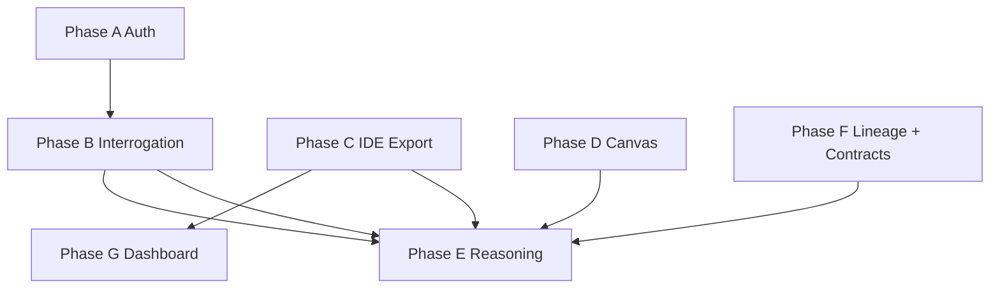

# Implementation Plan 1 — UX & IDE Hand-off (v2)

> **Requirements:** `changes.md` (v2 — REQ-1…REQ-9) · **Phase F v3** — lineage + contracts (this doc)  
> **Baseline:** Phases 0–7 · `pnpm gate:pre-ship`  
> **Review:** v2 re-evaluation — closes gaps vs original nine requests (unified right panel, auto-launch VS, hand-off API, diagram depth, explicit traceability)

---

## Accuracy review (v1 → v2)

| Gap in v1 | v2 fix |
|-----------|--------|
| Items 1 & 2 listed separately but same feature | Merged **Phase A**; mandate **icon + Sign out button** (not menu-only) |
| REQ-3: picker then wizard only; no auto-open IDE | **Auto-launch** deep link on Launch step; VS default `ide=vscode` |
| REQ-3: toolbar + header duplicate export | **Single export flow**; remove `lock-architecture-btn`; toolbar export calls same picker |
| REQ-4: token storage vague | **`GET …/ide-handoff`** returns one-time deep link; dashboard never stores raw token |
| REQ-7: split across AiReasoning vs DecisionTrace | **`ReasoningPanel`** unified component; Q&A always visible; REQ-9 below Q&A |
| REQ-7 vs PRD “trace primary” | **Phase F** elevates *critical* lineage decisions (not narration); Q&A stays visible but lineage is the hero when a node is selected (PRD §6A) |
| REQ-9 undersold as “topic list” | Reframed as **Decision Lineage surfacing** + **user contracts → IDE rules** (closed loop) |
| REQ-6 underspecified | Phase D expanded: arrows, edge kinds, swimlanes, minimap, optional animation |
| REQ-5 red = low score only | **Red precedence:** critical `governanceIssues` on service OR score &lt; threshold |
| Generation page omitted from shell | **All 6 routes** in AppShell |
| Antigravity “TBD” only | Research task + **https fallback** + copy link |
| Open “product decisions” | Resolved with defaults aligned to your requests (see §Decisions) |

---

## Requirements coverage matrix

| REQ | Covered in phase | Test gate IDs | Ship demo |
|-----|------------------|---------------|-----------|
| REQ-1, REQ-2 | A ✅ | A-E2E-01…05, A-UT/EC | Sign out from workspace → landing |
| REQ-8 | B ✅ | B-E2E-01…03, B-UT/EC | Click option → next Q |
| REQ-3 | C | C-E2E-01…04 | Export → VS → IDE opens |
| REQ-4 | G (after C) | G-E2E-01…03 | Dashboard “Open in Visual Studio” |
| REQ-5, REQ-6 | D | D-E2E-01…04 | Colored nodes + styled edges |
| REQ-9 | F | F-E2E-01…06, F-IT-01…04 | Critical lineage visible; user contracts → export → IDE enforcement |
| REQ-7 | E (uses B, F) | E-E2E-01…05 | Change answer → stats update |

**All nine requirements:** ✅ mapped. No orphan items.

---

## Architecture decision: unified right panel

Replace the swap between `AiReasoningPanel` / `DecisionTracePanel` with one **`ReasoningPanel`** aligned to **PRD §6A** (provenance over narration) and **REQ-9**:

```text
┌──────────────────────────────────────────┐
│ Stats: Accuracy | Confidence | Compliance │  ← REQ-7 (sticky)
├──────────────────────────────────────────┤
│ ★ Critical decisions (lineage, max 5)       │  ← REQ-9 / PRD §6A — PRIMARY when node selected
│   #1 … “Chosen because …” (expand chain)  │
│   Requirement → Constraint → Pattern →     │
│   Rules → Contracts → Implications         │
│   [Open full lineage graph]                │
├──────────────────────────────────────────┤
│ Service contracts (this component)           │  ← NEW Phase F — user-authored rules source
│   • list + Add contract (OpenAPI / paths)  │
│   • “Enforced in IDE on save” badge        │
├──────────────────────────────────────────┤
│ Interrogation Q&A (editable options)       │  ← REQ-7 (always visible, below lineage)
├──────────────────────────────────────────┤
│ (optional) Ask architecture input          │
└──────────────────────────────────────────┘
```

**No node selected:** show architecture-wide **top 5 critical decisions** (cross-service) + architecture contract summary; Q&A below.

**Node selected:** filter decisions and contracts to `serviceId`; ranking API accepts `serviceId`.

**PRD compliance:** No tabs; lineage is **proven** (resolved `source.ref` only); unresolved provenance is flagged, never shown as fact (`new_architecture.md` §Provenance Engine).

---

## Systems affected (complete)

### Web (`apps/web`)

| File | REQ | Action |
|------|-----|--------|
| **New** `components/layout/AppShell.tsx` | 1,2 | Fixed bottom-left slot on all routes |
| **New** `components/layout/UserProfileBar.tsx` | 1,2 | Avatar + “Sign out” button |
| `App.tsx` | 1,2 | Wrap all routes in `AppShell` |
| `pages/GenerationPage.tsx` | 1,2 | Inside shell (was missing in v1) |
| **New** `lib/ide.ts` | 3,4 | `IdeTarget`, labels, schemes, icons |
| **New** `lib/deeplink.ts` (extend) | 3,4 | `buildIdeDeepLink`, `launchIdeHandoff` |
| **New** `components/export/IdePickerModal.tsx` | 3 | VS first, recommended badge |
| `pages/WorkspacePage.tsx` | 3,5,6,7,9 | Remove lock; mount `ReasoningPanel`; header Export |
| `components/workspace/WorkspaceToolbar.tsx` | 3 | Export icon → same picker (no duplicate route) |
| **New** `components/workspace/ReasoningPanel.tsx` | 7,9 | Unified panel |
| **Remove swap** `AiReasoningPanel` / `DecisionTracePanel` | 7,9 | Deprecate or inline into ReasoningPanel |
| **New** `components/workspace/CriticalDecisionsSection.tsx` | 9 | Ranked lineage cards + expandable causal chain |
| **New** `components/workspace/ServiceContractsSection.tsx` | 9 | Add/edit contracts; link to lineage `contract` nodes |
| **New** `lib/lineage-display.ts` | 9 | Map `DecisionTrace` → UI steps; importance scoring |
| `components/workspace/ArchitectureCanvas.tsx` | 5,6 | Tiers, edgeTypes, swimlanes, MiniMap |
| `pages/InterrogationPage.tsx`, `OptionCard.tsx` | 8 | Auto-submit |
| `hooks/useInterrogation.ts` | 8 | `selectAndSubmitOption` |
| `pages/ExportWizardPage.tsx` | 3 | `?ide=vscode`; silent lock; auto-launch step 4 |
| `components/dashboard/MyProjectCard.tsx` | 4 | Dynamic IDE button + hand-off |
| `lib/api.ts` | 3,4,7 | New endpoints/types |
| `stores/useSessionStore.ts` | 2,7 | `reset()` on sign-out |

### API (`apps/api`)

| Area | REQ | Action |
|------|-----|--------|
| Migration | 3,4 | `ide_target` enum on `architecture_exports`; `last_workspace_id` on arch or join |
| `export.service.ts` | 3 | `ideTarget`; **auto-lock** on first export if not locked |
| `workspace.service.ts` | 3,4 | Persist register metadata |
| **New** `ide-handoff.service.ts` | 4 | Build fresh deep link for dashboard |
| `GET /api/architectures/:id/ide-handoff` | 4 | Auth JWT; returns `{ deepLink, ide, workspaceId }` |
| **New** `reasoning.service.ts` | 7 | Stats + questions + override |
| `GET /api/architectures/:id/reasoning` | 7 | Join `interrogation_session_id` |
| `POST /api/architectures/:id/reasoning/override` | 7 | Update answer → recompute stats + enqueue regen |
| `lineage-read.service.ts` | 9 | `rankCriticalDecisions()`, `getTopTopics()`, trace resolution |
| `GET /api/architectures/:id/lineage/topics` | 9 | Ranked decisions (≤5); `?serviceId=` |
| `GET /api/architectures/:id/lineage/decisions/:topicId` | 9 | Full expandable chain for one decision |
| **New** `contracts.service.ts` | 9 | CRUD `service_contracts`; compile → governance rules |
| `GET/POST/PATCH /api/architectures/:id/services/:sid/contracts` | 9 | User contract authoring |
| `POST …/contracts/:id/publish-to-lineage` | 9 | Upsert `contract` lineage node + `produces` edge |
| `export/build-artifacts.ts` | 9 | Merge user + generated contracts into bundle |
| `drift` rule index / `cursor-config` | 9 | Include **contract-derived rules** for IDE hot path |
| Architecture detail DTO | 5,6 | `connectionKind`, `confidenceTier`, `hasCriticalIssue` per service |
| `generation/persist.ts` / mock | 5,6 | Populate new fields |

### Extension (`apps/cursor-extension`)

| File | REQ | Action |
|------|-----|--------|
| `lib/deep-link.ts` | 3 | `vscode://`, `cursor://`, `antigravity://` (if valid) |
| `package.json` | 3 | `onUri` / uriHandler for vscode authority |
| `extension.ts` | 3 | Scheme-agnostic `handleDeepLink` |
| Branding | 3 | “ArchitectAI for Visual Studio Code” in setup webview |
| `lib/contract-rules.ts` (extension) | 9 | Load `.architectai/contracts.json` + user rules into matcher |
| Setup / Normal panels | 9 | Show “N contracts enforcing codegen” after pull |

### Shared (`packages/config`, `packages/shared`)

| Item | REQ |
|------|-----|
| `IdeTarget` = `vscode` \| `cursor` \| `antigravity` | 3,4 |
| `CONFIDENCE_TIER` thresholds + `tierFromScore(score, hasCritical)` | 5 |
| `ConnectionKind` = `sync` \| `async` \| `event` \| `dependency` | 6 |
| `CriticalDecisionTopic`, `ContractRuleCompileInput` | 9 |
| `ArchitectureSummary.lastExportIde`, `hasWorkspaceRegistration` | 4 |

### Docs & CI

- `docs/04_ARCHITECTAI_API_SPEC.yaml` — new routes/fields  
- `TEST_PLAN.md` — **Changes Batch 1** section  
- `gate:changes-1` script (end of doc)

---

## Locked decisions (v2 — no longer “TBD”)

| # | Decision | Choice | Rationale (your intent) |
|---|----------|--------|-------------------------|
| D1 | Lock UX | **Hidden auto-lock** on export wizard entry | You remove Lock button; audit preserved |
| D2 | Visual Studio | UI **“Visual Studio”** → scheme **`vscode://`** | Same extension; your priority IDE |
| D3 | Antigravity | Research URI; fallback **copy link + docs URL** | Ship picker; don’t block VS/Cursor |
| D4 | Override on locked arch | **Allow** → minor version + **async regen** job | “Changes update architecture” |
| D5 | Dashboard token | **Never** list API token; **ide-handoff** on click | Security |
| D6 | Accuracy (v1) | `answeredNonSkipped / totalQuestions * 100`, adjusted if override disagrees with AI pick | Understandable metric |
| D7 | Export entry | **Header Export** primary; toolbar uses same modal | One mental model |
| D8 | VS launch | **Auto** `location.href` on step 4; copy link secondary | “Extension should get started navigating” |
| D9 | Right panel | **Single** ReasoningPanel, no tabs | REQ-7 + PRD §8 |

---

## Phase A — Profile + sign-out (REQ-1, REQ-2) ✅

### Implementation

1. `UserProfileBar`: `fixed bottom-4 left-4 flex items-center gap-3 z-50`.
2. Profile: Clerk `UserButton` **or** dev avatar (initials from `clerkId`).
3. **Sign out** `Button` variant ghost — always visible text “Sign out”.
4. `signOut()`:
   - Clerk: `clerk.signOut(() => navigate('/'))`
   - Dev: clear `architectai_dev_clerk_id`, `useSessionStore.getState().reset()`, `navigate('/')`
5. `AppShell` wraps `<Routes>`; render `{children}` + `UserProfileBar` when authenticated (or always on landing if signed in).

### Tests

| ID | Type | Expected |
|----|------|----------|
| A-UT-01 | UT | Profile + Sign out render |
| A-E2E-01 | E2E | Sign out workspace → `/` |
| A-E2E-02 | E2E | Sign out dashboard → `/` |
| A-E2E-03 | E2E | Sign out interrogation → `/` |
| A-E2E-04 | E2E | Sign out generation → `/` |
| A-E2E-05 | E2E | Sign out export wizard → `/` |
| A-EC-01 | EC | Clerk signOut redirect `/` |
| A-EC-02 | EC | Double sign out idempotent |
| A-EC-03 | EC | Browser back after sign out → `/` |
| A-EC-04 | EC | In-flight API aborted; no 401 toast loop |

### Edge cases

- 🟡 Landing signed-in: profile visible; sign out stays on `/`.
- 🟡 Small viewport: bar above fold on interrogation (padding-bottom on main).

---

## Phase B — Interrogation auto-advance (REQ-8) ✅

### Implementation

1. `OptionCard`: `onClick` → `selectAndSubmit(optionId)` (not only `setSelectedOptionId`).
2. Keyboard `1`–`4`: set option + submit in same tick.
3. Hide **Apply & Continue** unless `editingQuestionId`.
4. Show card spinner / `pointer-events-none` while `loading`.
5. Remove Enter-to-continue on normal path (Enter in edit mode still saves).

### Tests

| ID | Type | Expected |
|----|------|----------|
| B-E2E-01 | E2E | Click option → next Q without Apply |
| B-E2E-02 | E2E | Key `2` → submit + advance |
| B-E2E-03 | E2E | Edit prior Q → Save required |
| B-UT-01 | UT | Double-click → one POST |
| B-EC-01 | EC | API fail → stay on Q, show error |
| B-EC-02 | EC | Last Q → Generate enabled (≥3 answered) |
| B-EC-03 | EC | Skip does not auto-advance to wrong index |

### Edge cases

- 🟡 Freeform field: submit includes `freeformAnswer` if non-empty when option clicked.
- 🟡 Rapid 1–4 key repeat: debounce 300ms.

**E2E:** Update `phase2.spec.ts` — remove `Apply & Continue` click in happy path.

---

## Phase C — Export + IDE picker + VS launch (REQ-3)

### Implementation

#### Web

1. Delete `lock-architecture-btn` and `handleLock` UI from `WorkspacePage`.
2. Header **Export** + toolbar export → `IdePickerModal`:
   - Row 1: **Visual Studio** — badge “Recommended”
   - Row 2: Cursor
   - Row 3: Antigravity
3. On pick → `navigate(/export/:id?ide=${target})`.
4. `ExportWizardPage`:
   - `useEffect`: if not locked → `lockArchitecture()` once (silent).
   - Pass `ideTarget` to register + export bodies.
   - Step 4: primary button **Open in {IDE}** → `launchIdeHandoff(deepLink)`; secondary **Copy link**.
   - Default `ide` query = `vscode` if missing.

#### API

- `architecture_exports.ide_target` NOT NULL default `cursor` for migration backfill.
- Register workspace stores `workspace_path`, `ide_target`.

#### Extension

- Parse any supported scheme; same `connect` path.
- Publish VSIX as “works with VS Code and Cursor”.

### Tests

| ID | Type | Expected |
|----|------|----------|
| C-IT-01 | IT | Export without prior lock → 200 + lock audit |
| C-IT-02 | IT | `ideTarget: vscode` stored |
| C-E2E-01 | E2E | Picker shows VS first |
| C-E2E-02 | E2E | Wizard deep link `vscode://` |
| C-E2E-03 | E2E | No lock button in workspace |
| C-UT-01 | UT | `buildIdeDeepLink('vscode', …)` |
| C-UT-02 | UT | Extension parses vscode URI |
| C-EC-01 | EC | `status !== ready` → Export disabled |
| C-EC-02 | EC | Extension missing → install banner + copy link |
| C-EC-03 | EC | Lock fails → wizard error, no partial export |
| C-EC-04 | EC | Antigravity: hand-off URL or copy-only |

### Edge cases

- 🔴 **C-EC-05** macOS vs Windows handler registration (manual matrix).
- 🟡 Re-export different IDE updates `lastExportIde`.

---

## Phase D — Canvas confidence + relationships (REQ-5, REQ-6)

### Implementation

#### REQ-5

- `packages/config`: `CONFIDENCE_TIER_HIGH = 80`, `PARTIAL = 50`.
- `tier(service)`: if critical/high issue on `serviceId` → `critical` (red); else by score.
- `ServiceNode`: classes `node-tier-high|partial|critical` + `AlertCircle` icon for red.
- Legend component bottom-right of canvas.

#### REQ-6

- Extend connection model: `kind: sync | async | event | dependency` (infer from protocol in mock if needed).
- Custom `edgeTypes`: `SyncEdge`, `AsyncEdge`, `EventEdge` — arrows, dash, color from tokens.
- Background **swimlanes** from `detail.layers` (horizontal bands).
- Enable React Flow `<MiniMap />`, `<Controls />`, `fitView` on load.
- Edge click: optional tooltip with protocol + kind.

### Tests

| ID | Type | Expected |
|----|------|----------|
| D-UT-01 | UT | Tier: critical issue → red at score 90 |
| D-UT-02 | UT | Score 79 → yellow, 80 → green |
| D-E2E-01 | E2E | `data-tier` on nodes |
| D-E2E-02 | E2E | ≥2 edge types visible in mock arch |
| D-E2E-03 | E2E | Minimap renders |
| D-EC-01 | EC | 0 connections → nodes only |
| D-EC-02 | EC | Focus mode preserves tier colors (opacity) |
| D-EC-03 | EC | Color-blind: icon on red/yellow |

---

## Phase F — Decision Lineage surfacing + user contracts → IDE rules (REQ-9, PRD §6A)

*Implemented before Phase E so `ReasoningPanel` consumes ranked **critical decisions** and contract authoring. This phase is the product’s trust differentiator — not a trim list, but **the most important provenance surfaced clearly** plus **contracts the user owns** that become executable governance in the IDE.*

### Product context (from `new_PRD.md` + `new_architecture.md`)

| For users | What the product does |
|-----------|------------------------|
| **Staff / Principal engineer** | Answers *why* Kafka (not RabbitMQ) with evidence: requirement, constraint, rule MQ-04, rejected alternatives — not prose. |
| **Architect / governance lead** | Sees which decisions are **highest-stakes** (critical rules, unresolved evidence, cross-service impact) without reading the whole graph. |
| **Developer in IDE** | Codes against **contracts they defined** (or refined) on the web; saves trigger drift checks against those contracts during generation — same rules in `.architectai/rules.json`. |

**Closed loop (architecture §8, §Provenance Engine):**

```text
Interrogation + PRD → Generation emits lineage (SSE `lineage`) → persisted graph + per-service DecisionTrace
       ↓
Workspace: user sees TOP critical decisions + expands full causal chain
       ↓
User adds/refines ServiceContract (OpenAPI) → compiled to governance rules → lineage `contract` node
       ↓
Export → .architectai/contracts.json + rules.json → IDE pull → drift on save enforces during codegen
```

**What we intentionally remove:** per-layer italic “AI narration” without `source.ref` (`new_PRD.md` §6A.2). **What stays:** actionable governance urgency, folded into decision ranking (not a separate unbounded list).

### REQ-9 reinterpretation (v3)

| v2 (too thin) | v3 (this plan) |
|---------------|----------------|
| “Top 5 topics” title + one-line summary | **Critical decision cards** with `chosenBecause`, evidence chips, and **expand → full trace chain** (7 step types) |
| Cap graph at 5 nodes | Default graph filter = top 5 **decisions** ± 1-hop; **Show all** for full `ArchitectureLineage` |
| No user contracts | **User-authored contracts** per service; define API surface → **rules** in IDE |

### F1 — Rank & display critical decisions (lineage)

#### Importance scoring (`rankCriticalDecisions`)

Base score per trace / lineage slice; return **max 5**, sorted stable:

| Signal | Weight | Rationale |
|--------|--------|-----------|
| Governance issue `critical` on `serviceId` | +100 | PRD: highest user stakes |
| Unresolved `source.ref` on any step | +80 | Anti-hallucination — must surface, not hide |
| Lineage node `rule` with `governs` + “overrode” rationale | +60 | Selection-influence decisions (`new_architecture.md`) |
| Has `contract` step with `is_enforced` | +50 | Boundary/API decisions affect IDE |
| Rejected alternative with `critical` downstream | +40 | Trade-off the user must understand |
| Linked to `selectedServiceId` (when filtering) | +20 | Contextual focus |
| `confidence` impact on architecture | +30 | Tie-breaker |

Each item returned:

```typescript
interface CriticalDecisionTopic {
  id: string;                    // trace id or primary pattern node id
  serviceId: string | null;
  title: string;                 // e.g. "Kafka Event Bus"
  severity: "critical" | "high" | "medium";
  stepType: "pattern" | "rule" | "contract" | "constraint";
  summary: string;               // one-line "Chosen because…"
  chosenBecause: string[];       // bullet chips for collapsed card
  hasUnresolvedProvenance: boolean;
  contractIds?: string[];        // linked service_contracts
}
```

`GET /api/architectures/:id/lineage/topics?limit=5&serviceId=` → `{ topics: CriticalDecisionTopic[] }`.

`GET /api/architectures/:id/lineage/decisions/:topicId` → resolved chain:

```typescript
{
  steps: Array<{
    kind: "requirement" | "constraint" | "pattern" | "alternative" | "rule" | "contract" | "implication" | "assumption";
    label: string;
    detail: string;
    source?: { kind: string; ref: string; confidence: number; resolved: boolean };
    rejected?: boolean;
  }>;
}
```

Reuse existing `GET …/lineage` + `GET …/services/:sid/trace`; new endpoints are thin wrappers over `lineage-read.service.ts`.

#### Web UI (`CriticalDecisionsSection`)

- **Collapsed card:** title, severity badge, `chosenBecause` bullets (max 3), “Unresolved evidence” warning if any.
- **Expand:** ordered chain matching PRD §6A worked example (Requirement → … → Implications).
- **#1 decision** expanded by default when a node is selected (the *most important* lineage visible immediately).
- **Jump actions:** “View in lineage graph”, “Edit contract” (if step type `contract`).
- `data-testid`: `critical-decision-card-{id}`, `critical-decision-expand-{id}`.

#### Lineage graph (`LineageGraphView`)

- Default: nodes for top 5 decisions + 1-hop neighbors (requirements, rules, contracts).
- Color by `LineageNodeType` (reuse Phase D React Flow patterns).
- **Show all nodes** → full graph; **Back to critical** restores filter.
- Selecting a graph node focuses the matching card in the panel (bidirectional).

### F2 — User-authored contracts → IDE rules (codegen governance)

**Problem:** Generated contracts alone are not enough — users must **define the API boundary** they intend to enforce while coding (PRD: “contracts before code”, architecture §2 rule 6).

#### Data (existing + extensions)

- Table: `service_contracts` (`openapi_spec`, `endpoints_json`, `is_enforced`) — already in schema.
- Optional migration: `source` enum (`generated` | `user`) + `created_by_id` for audit.

#### API

```typescript
// GET /api/architectures/:id/services/:serviceId/contracts
{ contracts: ServiceContractDto[] }

// POST …/contracts
{ name, version?, openapiSpec | endpoints[], isEnforced?: true }
// → 201 + contract row + async compileContractRules()

// PATCH …/contracts/:contractId
// → updates openapi, recompiles rules, bumps architecture patch version if locked

// POST …/contracts/:contractId/publish-to-lineage
// → upsert decision_lineage_nodes type=contract + produces edge from pattern node
```

#### `compileContractRules(contract)` (API)

Derive `GovernanceRule[]` entries from OpenAPI paths/methods:

- `type: "contract"` — endpoint must exist with method/path/auth
- `type: "dependency"` — forbidden imports crossing service boundary without contract
- Link `rule.condition.contractId` to contract row

Persist into active ruleset (org default) **or** architecture-scoped overlay stored in export bundle only (MVP: **export overlay** — rules merged at `build-artifacts` time, no global ruleset mutation).

#### Export & IDE

- `build-artifacts.ts`: merge generated + **user** contracts into `.architectai/contracts.json`.
- `rules.json`: include **contract-compiled rules** alongside boundary/forbidden-patterns.
- Extension: on config pull + `architecture.updated`, refresh contract rules in drift index.
- **User-visible:** Setup webview line — “12 contract rules active for Payment Service”.

#### Web UI (`ServiceContractsSection`)

- Shown under critical decisions when `selectedServiceId` set (or architecture-wide list when none).
- **Add contract:** paste OpenAPI snippet or minimal form (name, path, method, auth).
- Toggle **Enforced in IDE** (`is_enforced`).
- After save: toast “Contract rules will apply on next export / IDE sync”.
- Link from expanded lineage **contract** step → scroll to contract editor.

### F3 — Generation & trace completeness (align PRD)

- Mock/real generation: every service trace must include ≥1 `contract` node (already in eval intent — enforce in `lineage-integrity` + Phase F gate).
- User-added contract after generation: `publish-to-lineage` adds node without regen (MVP); optional Phase F+ regen banner.

### Tests

| ID | Type | Expected |
|----|------|----------|
| F-UT-01 | UT | Ranking: critical issue beats score-90 without issue |
| F-UT-02 | UT | Unresolved `source.ref` boosts rank + sets flag |
| F-UT-03 | UT | `compileContractRules` emits contract-type rules with `contractId` |
| F-IT-01 | IT | 20 lineage nodes → 5 topics; stable sort |
| F-IT-02 | IT | `GET …/decisions/:id` returns 7-step chain with resolved sources only |
| F-IT-03 | IT | POST contract → row + rules in export bundle |
| F-IT-04 | IT | User contract → lineage `contract` node + `produces` edge |
| F-E2E-01 | E2E | Panel shows ≤5 **critical decision** cards with `chosenBecause` |
| F-E2E-02 | E2E | Select node → #1 expanded; decisions filtered to service |
| F-E2E-03 | E2E | Expand card → requirement/rule/contract steps visible |
| F-E2E-04 | E2E | Add contract → appears in section + export bundle (API assert) |
| F-E2E-05 | E2E | Lineage graph “Show all” → >5 nodes; back restores filter |
| F-E2E-06 | E2E | Unresolved provenance shows warning, not fake evidence |
| F-EC-01 | EC | 3 decisions exist → show 3 (no padding) |
| F-EC-02 | EC | Service not in arch top 5 → still show **best 5 for that service** |
| F-EC-03 | EC | Invalid OpenAPI → 400, no partial rule write |
| F-EC-04 | EC | Contract disabled (`is_enforced=false`) → excluded from IDE rules.json |
| F-EC-05 | EC | Export without re-lock still includes latest user contract (version stamp) |

### Edge cases

- 🔴 **F-EC-06** User edits contract while IDE workspace open → `architecture.updated` → extension re-pulls rules (same as re-export).
- 🟡 **F-EC-07** Lineage stale after interrogation override (Phase E) — banner “Regenerating lineage…” until complete.
- 🟡 **F-EC-08** Contract on service A references connection to B — implication edge auto-suggested in lineage (optional MVP: manual only).

### Phase F gate

```json
"gate:phase-f": "pnpm --filter @architectai/api exec vitest run test/api/lineage-topics.test.ts test/api/contracts.test.ts && pnpm --filter @architectai/web test && pnpm --filter @architectai/web exec playwright test e2e/phase-f.spec.ts"
```

---


## Phase E — Reasoning panel stats + Q&A + overrides (REQ-7)

### Implementation

1. `ReasoningPanel` fetches `GET …/reasoning` on mount and when `architectureId` / `selectedServiceId` changes.
2. **Stats row** — three metric cards; animate on change.
3. **Q&A** — `QuestionBlock` per question; options as radio group; selected = highlighted border/background.
4. Change option → `POST …/reasoning/override` → optimistic UI → poll or SSE until `confidenceScore` / `governanceScore` update.
5. **Critical decisions section** — call `…/lineage/topics` + expand `…/lineage/decisions/:id` (Phase F).
6. **Contracts section** — `ServiceContractsSection` when node selected (Phase F).
7. Regen banner when override triggers generation job.

### API

```typescript
// GET /api/architectures/:id/reasoning
{
  stats: { accuracy: number; confidence: number; compliance: number };
  questions: Array<{
    id: string;
    prompt: string;
    options: Array<{ id: string; label: string; recommended?: boolean }>;
    selectedOptionId: string | null;
    status: 'answered' | 'skipped';
  }>;
}

// POST /api/architectures/:id/reasoning/override
{ questionId: string; selectedOptionId: string }
// → 202 { stats, regenerationJobId? }
```

Link override to `interrogation_sessions` via `architectures.interrogation_session_id`.

### Tests

| ID | Type | Expected |
|----|------|----------|
| E-IT-01 | IT | GET reasoning with session |
| E-IT-02 | IT | POST override updates answer + stats |
| E-E2E-01 | E2E | Stats visible top of right panel |
| E-E2E-02 | E2E | Selected option highlighted |
| E-E2E-03 | E2E | Change option → stats change |
| E-E2E-04 | E2E | Node select → critical decisions ≤5 for service |
| E-EC-01 | EC | No session linked → empty Q&A, stats from arch only |
| E-EC-02 | EC | Override during regen → queued or 409 |
| E-EC-03 | EC | No tabs in panel (DOM assert) |

### Edge cases

- 🔴 **E-EC-04** Lineage stale until regen completes — show banner.
- 🟡 Locked arch override — D4: allow with version bump.

---

## Phase G — Dashboard IDE button (REQ-4)

### Implementation

1. `listArchitectures` returns `lastExportIde`, `lastWorkspaceId` (no token).
2. `MyProjectCard` footer:
   - If `lastExportIde` → `Open in {label}` → `fetchIdeHandoff(archId)` → `launchIdeHandoff`.
   - Else → `Export` → workspace or picker.
3. `testid`: `my-project-open-ide-{ide}`.

### Tests

| ID | Type | Expected |
|----|------|----------|
| G-IT-01 | IT | ide-handoff returns vscode deep link |
| G-E2E-01 | E2E | After VS export, card shows Visual Studio |
| G-E2E-02 | E2E | href / navigation uses vscode scheme |
| G-EC-01 | EC | Never exported → Export CTA |
| G-EC-02 | EC | hand-off 401 → re-auth |
| G-EC-03 | EC | No workspace register → wizard, not broken link |

---

## Recommended implementation order

```text
A (profile) → B (interrogation) → C (IDE export) → G (dashboard)
                                    ↓
              D (canvas) ──→ F (lineage + contracts) ──→ E (reasoning panel)
```

| Sprint | Phases | Outcome |
|--------|--------|---------|
| 1 | A + B | Auth chrome + faster interrogation |
| 2 | C + G | Full IDE hand-off loop |
| 3 | D + F | Visual architecture + provenance + user contracts → IDE |
| 4 | E | Reasoning panel + live overrides |

---

## Cross-phase dependency diagram



---

## `gate:changes-1` (Batch 1 complete)

Add to root `package.json`:

```json
"gate:changes-1": "pnpm gate:pre-ship && pnpm --filter @architectai/api exec vitest run test/api/ide-handoff.test.ts test/api/reasoning.test.ts test/api/lineage-topics.test.ts test/api/contracts.test.ts && pnpm --filter @architectai/web exec playwright test e2e/changes-batch1.spec.ts"
```

Plus new Playwright `e2e/changes-batch1.spec.ts` covering REQ-1,3,4,7,8 smoke paths.

### Regression

- `pnpm gate:pre-ship` every PR
- Update `phase2.spec.ts`, `phase4.spec.ts`, `phase6.spec.ts` selectors
- Extension `deep-link.test.ts` — vscode + cursor schemes

---

## Manual acceptance script (your nine requirements)

| Step | REQ | Action |
|------|-----|--------|
| 1 | 1,2 | Sign in → visit all pages → profile + Sign out visible → sign out → landing |
| 2 | 8 | Interrogation: click option → next question with no Apply |
| 3 | 3 | Workspace: Export → pick Visual Studio → wizard → IDE opens |
| 4 | 5,6 | Workspace: see green/yellow/red nodes, directed edges, layers |
| 5 | 7,9 | Right panel: stats; **#1 critical decision expanded**; Q&A; add contract → export |
| 6 | 4 | Dashboard: card shows “Open in Visual Studio” → opens IDE |
| 7 | 9 | Lineage graph “Show all”; contract rules in IDE setup after export |

---

## Definition of done (Batch 1)

1. Traceability matrix: all REQ-1…REQ-9 ✅ in `changes.md`.
2. `gate:changes-1` green.
3. Manual script above passed on `pnpm dev:local` (or Docker stack).
4. `TEST_PLAN.md` updated with Changes Batch 1 gates.
5. No PRD §8 violations (dark-only, no right-panel tabs, 48px toolbar, kbd hints).

---

## Antigravity research note (REQ-3)

Before Phase C ships Antigravity row:

- Confirm product URI scheme (Windsurf / Google Antigravity IDE).
- If none: picker still lists it; step 4 shows **Copy workspace path + install guide** only.
- Do **not** delay VS Code or Cursor hand-off.

---

## Files

| File | Status |
|------|--------|
| `changes.md` | v2 — traceability + unified panel spec |
| `changes_implementation_plan_1.md` | v2 — this document |
| `TEST_PLAN.md` | Update when implementation starts |
