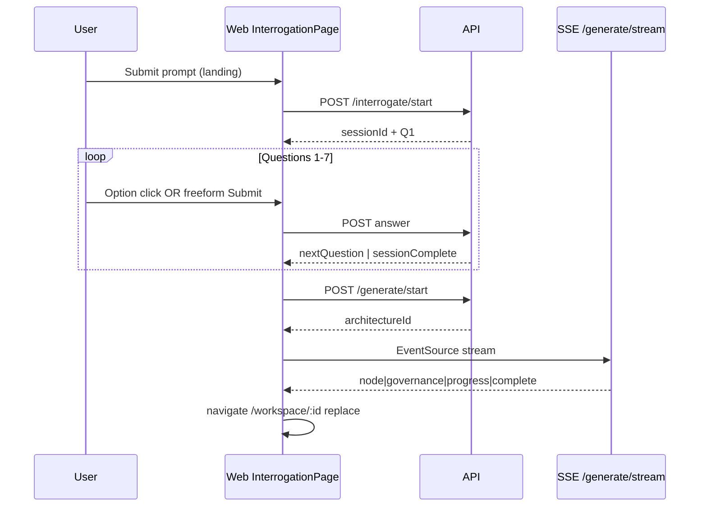
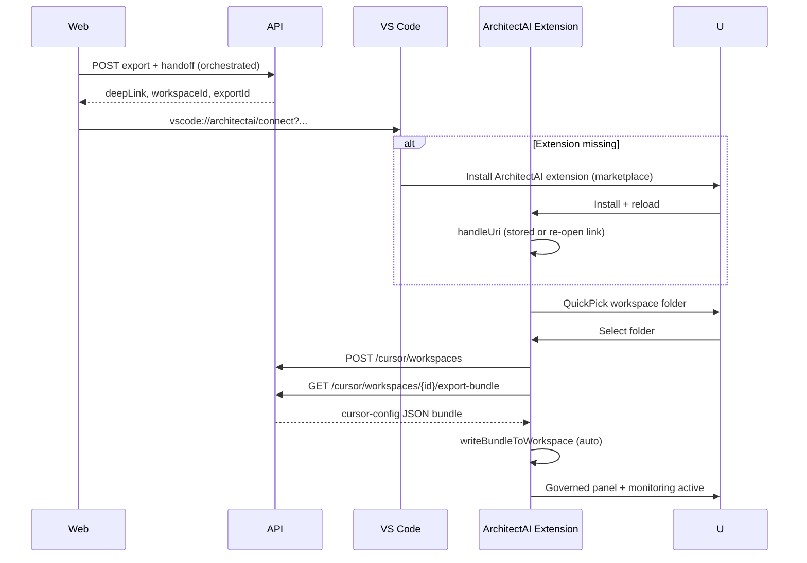
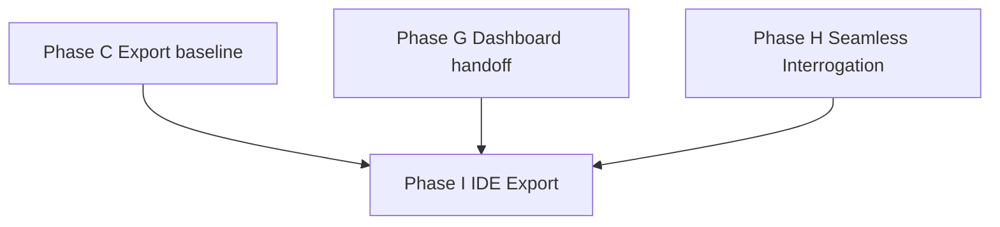

# Implementation Plan 2 — Seamless Flow & IDE-Native Export (v1)

> **Requirements:** This document (REQ-10, REQ-11) · **Baseline:** Plan 1 complete (`changes_implementation_plan_1.md`, `pnpm gate:phase-g`)  
> **Companion:** `changes.md` (update traceability when implementation starts) · `TEST_PLAN.md` · `new_PRD.md` §3 loop · `docs/05` screens 3–4, 9 · `docs/01` interrogation bounds  
> **Date:** 2026-05-29

---

## Executive summary

Batch 2 removes two friction points in the core loop:

1. **Interrogation → architecture** feels like one continuous session: no separate “Generate Architecture” step, no detached generation page, working manual answers, and a polished in-flow loading experience that lands directly on the workspace canvas.
2. **Export → Visual Studio** is IDE-first: VS Code opens, guides extension install if missing, prompts for workspace selection, then **automatically** writes governance artifacts into the chosen folder—without a multi-step web wizard for the happy path.

---

## Accuracy review (current codebase → gaps)

| Area | Current behavior (verified) | Gap vs requested experience |
|------|----------------------------|-----------------------------|
| Interrogation CTA | `InterrogationPage` shows **Generate Architecture** → navigates to `/generate/:id` | Extra button + route break continuity |
| Generation | Standalone `GenerationPage` with checklist, node stream, **Open workspace** CTA | User sees a “second app screen”; should be inline loader then auto-enter workspace |
| Manual answer | Freeform `<input>` has no **Submit**; only option click calls `selectAndSubmitAnswer` which **requires** `selectedOptionId` | Typed answers cannot be submitted (API supports freeform-only; UI does not) |
| Option advance | Phase B: click / keys 1–4 → `selectAndSubmitAnswer` | ✅ Works; keep and harden |
| Question count | `INTERROGATION.maxQuestions = 7`, `minQuestions = 3`; API may set `sessionComplete` early via LLM `suggestComplete` | Product wants **all 7 answered** before generation starts |
| Export (VS) | `IdePickerModal` → 4-step `ExportWizardPage` (path, register, convert, launch) | User must pre-enter path on web; extension **Initialize Workspace** is manual; bundle not auto-pulled on connect |
| Extension install | `launchIdeHandoff` sets `window.location.href`; copy-link hint if IDE does not open | No structured **install extension** prompt inside VS Code |
| Workspace pick | Web collects `workspacePath`; extension assumes folder already open | Should be **QuickPick in IDE**: open existing / create new |
| Artifact upload | `initializeWorkspace()` writes files **if** `exportBundleJson` populated; deep link only pulls `CursorConfig` | Export bundle not delivered on hand-off; auto-init not guaranteed |

---

## Requirements coverage matrix

| REQ | Summary | Acceptance criterion | Phase |
|-----|---------|----------------------|-------|
| **REQ-10** | Seamless interrogation → generation → workspace | No Generate button; no user-facing generation page; manual submit works; options auto-advance; after Q7 → graphical loader → workspace | H |
| **REQ-11** | VS export: install extension → pick workspace → auto artifacts | Export picks VS → IDE opens → install prompt if needed → workspace picker → `.architectai/` written automatically → governed mode | I |

**Dependencies:** Plan 1 phases A, B (partial), C, G remain prerequisites. Phase H **extends** B; Phase I **replaces** the web-heavy portion of C’s happy path for `vscode`.

---

## Product decisions (defaults)

| # | Decision | Rationale |
|---|----------|-----------|
| D1 | Auto-start generation when **`sessionComplete`** (7 questions answered/skipped per session rules), not when `canGenerate` (≥3) | Matches “all seven questions” |
| D2 | Disable LLM **`suggestComplete`** early exit for MVP Batch 2 (or ignore until `questions.length === 7`) | Prevents skipping questions 4–7 |
| D3 | Keep `/generate/:architectureId` as **internal redirect** only (bookmark/recovery → forwards to interrogation loader or workspace) | Avoid breaking SSE URLs in tests |
| D4 | Generation UI = **full-viewport overlay** on `/interrogate/:sessionId` (same URL), not a route change | Seamless perception |
| D5 | On generation **complete**, `navigate(/workspace/:id, { replace: true })` with no intermediate button | Zero extra click |
| D6 | Freeform path: **Submit** button + **Enter** (Shift+Enter = newline if textarea) | Explicit commit for typed answers |
| D7 | Option path: keep **auto-submit on select** (no Submit) | REQ-10 |
| D8 | VS happy path: **web orchestrates** lock+export+handoff; **extension owns** workspace path + file write | Split responsibilities cleanly |
| D9 | Extension ID for marketplace install URI: `architectai.architectai` (`publisher` + `name` from `apps/cursor-extension/package.json`) | Standard `vscode:extension/{publisher}.{name}` |
| D10 | Cursor / Antigravity: keep simplified web fallback (wizard or copy-link) in Batch 2; **VS Code path is production-grade target** | Scope control |

---

## Architecture: unified interrogation flow (REQ-10)

```text
Landing (prompt submit)
    │
    ▼
/interrogate/:sessionId  ──questions 1..7──►  (options: auto-advance | freeform: Submit)
    │
    │ sessionComplete + POST /generate/start
    ▼
[Generation overlay on SAME page — SSE stream, animated progress]
    │
    │ SSE type=complete
    ▼
/workspace/:architectureId   (replace navigation — no GenerationPage CTA)
```



---

## Phase H — Seamless interrogation → generation (REQ-10)

### H.1 — Remove friction UI

| File | Action |
|------|--------|
| `apps/web/src/pages/InterrogationPage.tsx` | Remove `generate-architecture-cta` block, `generate-disabled-reason`, footer tied to manual generate |
| `apps/web/src/lib/interrogation-ui.ts` | Deprecate `canShowGenerateButton` / `generateDisabledReason` or repurpose for overlay only |
| `apps/web/src/App.tsx` | Keep `/generate/:id` route → thin `GenerationRedirectPage` (see H.4) |
| `apps/web/src/pages/GenerationPage.tsx` | Extract presentation into `GenerationExperience.tsx`; page becomes redirect wrapper |

**Do not remove:** answered-question history, skip, edit flow (Phase B), progress bars, step dots.

### H.2 — Fix manual (freeform) answers

**Root cause:** `selectAndSubmitAnswer(questionId, selectedOptionId, …)` always passes an option id; freeform-only submission never calls the API.

| Layer | Change |
|-------|--------|
| `hooks/useInterrogation.ts` | Add `submitFreeformAnswer(questionId, text)` → `api.answerQuestion` with `{ freeformAnswer: text }` only (no `selectedOptionId`) |
| `InterrogationPage.tsx` | Replace plain `<input>` with **input + Submit button** (`data-testid="freeform-submit-btn"`); `Enter` submits when text non-empty |
| Interaction | When freeform has text: option clicks **clear or conflict** — recommended: options disabled while freeform non-empty OR clicking option clears freeform and selects option |
| API | No change required — `answerQuestion` already validates `selectedOptionId \|\| freeformAnswer` (`interrogation.service.ts:298`) |

### H.3 — Enforce seven questions before auto-generation

| Layer | Change |
|-------|--------|
| `packages/config` | Document: `maxQuestions: 7` is the generation gate for Batch 2 |
| `interrogation.service.ts` | Set `sessionComplete = true` only when `answered + skipped >= 7` OR `updatedQuestions.length >= 7` and last question resolved; **ignore `suggestComplete` until count === 7** |
| `useSessionStore` | Track `sessionComplete` from API in `applyAnswerResult`; hydrate from `session.status === 'complete'` |
| `InterrogationPage.tsx` | `useEffect`: when `sessionComplete && !generationStarted`, call `startGeneration(sessionId)` once (idempotent guard) |

**Skip behavior:** Skipped questions count toward the 7 (already counted in `countAnswered` for progress); product copy should warn skip still advances step count.

### H.4 — Graphical generation overlay

**New components** (`apps/web/src/components/generation/`):

| Component | Responsibility |
|-----------|----------------|
| `GenerationOverlay.tsx` | Full-screen overlay; mounts when `phase === 'generating'` |
| `GenerationProgressArt.tsx` | Animated diagram skeleton (layers/services appearing); consumes `useGenerationStream` nodes |
| `GenerationChecklist.tsx` | Governance checklist with check animations (reuse stream governance events) |
| `GenerationMetrics.tsx` | Confidence / governance / trust scores from progress events |

**Hook:** Reuse `useGenerationStream(architectureId)` unchanged.

**Overlay behavior:**

- Show after `startGeneration` returns `architectureId`
- Subscribe SSE immediately (same as current `GenerationPage`)
- Display cancel only as subtle secondary control (PRD: cancel available — `docs/05` rule 8)
- On `complete`: `navigate(\`/workspace/${id}\`, { replace: true })`
- On error: inline retry + “Return to questions” (re-open last session if still active)

**`GenerationRedirectPage`:** If user hits `/generate/:id` directly:

- If architecture `status === 'ready'` → redirect workspace
- If generation in progress → redirect `/interrogate/:sessionId?generating=:architectureId` OR render overlay on interrogation route with query param

### H.5 — API / generation (minimal)

| Endpoint | Change |
|----------|--------|
| `POST /api/generate/start` | Ensure idempotent if called twice for same session (409 or return existing `architectureId`) |
| `GET /api/generate/stream/:id` | No change |
| `GET /api/interrogate/:sessionId` | Include `status: 'complete'` and `architectureId` when generation already started (optional convenience) |

### H.6 — Tests (Phase H)

| ID | Type | Expected |
|----|------|----------|
| H-UT-01 | UT | `submitFreeformAnswer` POST body has `freeformAnswer`, no `selectedOptionId` |
| H-UT-02 | UT | `sessionComplete` gate: 6 answers → no auto-gen trigger |
| H-IT-01 | IT | Answer Q7 → `session.status === complete` |
| H-IT-02 | IT | `suggestComplete` at Q3 does **not** end session (Batch 2 rule) |
| H-E2E-01 | E2E | Full flow: prompt → 7 options → overlay visible → workspace without clicking Generate |
| H-E2E-02 | E2E | Type freeform + Submit → next question |
| H-E2E-03 | E2E | Option click → next question without Submit |
| H-E2E-04 | E2E | No `generate-architecture-cta` in DOM after Q1 |
| H-EC-01 | EC | Freeform empty → Submit disabled |
| H-EC-02 | EC | Generation API fail → error overlay, session preserved |
| H-EC-03 | EC | SSE disconnect → reconnect via `Last-Event-ID` (existing behavior) |
| H-EC-04 | EC | User refreshes during generation → recovery via redirect route |

**Gate script (add to root `package.json`):**

```json
"gate:phase-h": "pnpm --filter @architectai/api exec vitest run test/api/interrogation-gates.test.ts test/api/phase-h.interrogation.test.ts && pnpm --filter @architectai/web typecheck && pnpm --filter @architectai/web test && pnpm --filter @architectai/web exec playwright test e2e/phase-h.spec.ts"
```

**Regression:** `pnpm gate:phase-b` tests updated — remove assertions on Generate button enabled at 3 answers; replace with H-E2E scenarios.

---

## Phase I — IDE-native Visual Studio export (REQ-11)

### Target experience (happy path)

```text
Workspace → Export → Visual Studio
    │
    ▼
Web: silent lock + export(cursor-config) + create/refresh workspace row + build vscode:// deep link
    │
    ▼
Web: launchIdeHandoff(deepLink) — user leaves browser
    │
    ▼
VS Code opens
    ├─ Extension NOT installed → VS Code marketplace install prompt (vscode:extension/architectai.architectai)
    └─ Extension installed → handleDeepLink(connect URI)
            │
            ├─ No folder open → QuickPick: "Open folder…" | "Create new workspace…"
            ├─ POST /api/cursor/workspaces { workspacePath, architectureId, ideTarget: vscode }
            ├─ GET /api/cursor/workspaces/{id}/export-bundle (scoped token) — NEW
            └─ Auto write .architectai/* + show Governed panel (no manual Initialize click)
```



### I.1 — Web: one-click VS export (replace wizard happy path)

| File | Action |
|------|--------|
| **New** `apps/web/src/lib/export-handoff.ts` | `runVsCodeExportHandoff(architectureId)` — orchestrates API calls + `launchIdeHandoff` |
| `IdePickerModal.tsx` | On `vscode` pick: call `runVsCodeExportHandoff` instead of `navigate(/export/...)` |
| **New** `apps/web/src/components/export/ExportLaunchOverlay.tsx` | Brief “Opening Visual Studio…” state + copy-link fallback |
| `ExportWizardPage.tsx` | Retain for **recovery**, Cursor, Antigravity, and manual path entry — not default for VS |

**Orchestration (client or single BFF endpoint):**

Preferred: **one API** to avoid partial state:

| Endpoint | Auth | Response |
|----------|------|----------|
| `POST /api/architectures/:id/export/ide-handoff` | User JWT | `{ deepLink, ide, workspaceId, apiToken, exportId, bundleReady: true }` |

Server steps inside transaction:

1. `lockArchitecture` if needed (same as Phase C)
2. `exportArchitecture(..., 'cursor-config', 'vscode')`
3. `registerWorkspace` with **placeholder path** `pending:{architectureId}` OR defer registration to extension-only (recommended: **extension registers** — web only exports + mints token via existing `ide-handoff.service`)

**Revised handoff (align with existing Phase G):**

- Extend `ide-handoff.service.ts` to attach **latest export bundle reference** (S3 key or inline hash) on workspace row after export
- Web flow: `POST export` → `GET ide-handoff` → launch deep link (two calls, acceptable for MVP)

### I.2 — API: export bundle delivery to extension

| Endpoint | Auth | Response |
|----------|------|----------|
| `GET /api/cursor/workspaces/:workspaceId/export-bundle` | Scoped workspace token | `{ format: 'cursor-config', content: string }` (same JSON as export API) |

Implementation:

- Read latest `architecture_exports` row for workspace’s `architectureId`
- Return rendered bundle from storage (`export/storage.ts`)
- Audit: `cursor.bundle.pulled`

**Security:** Token-bound; workspaceId in path must match token’s workspace.

### I.3 — Extension: install, workspace pick, auto-init

| File | Action |
|------|--------|
| `extension.ts` | After `handleDeepLink`: if `!vscode.workspace.workspaceFolders?.length`, show `showWorkspaceFolderPicker` |
| **New** `lib/workspace-onboarding.ts` | `pickOrCreateWorkspace()` → `Uri` |
| `extension.ts` | If deep link has no `workspaceId`: `registerWorkspace` from extension with chosen path |
| `api-client.ts` | `pullExportBundle(workspaceId)` |
| `extension.ts` | On successful connect: `pullExportBundle` → `writeBundleToWorkspace` → `showNormalPanel()` **without** setup button |
| **New** `panels/installPanelHtml.ts` | Webview: “Install ArchitectAI to continue” with link `vscode:extension/architectai.architectai` |
| `extension.ts` | On activation when URI handler fires but extension was just installed: replay pending connect query from `globalState` |

**Install detection:**

- `vscode.extensions.getExtension('architectai.architectai')` — if undefined, show install panel / notification with marketplace link
- Deep link received while VS Code open but extension disabled → prompt Enable

**Create new workspace:**

- Option A: `vscode.openFolder` with new empty dir (user picks parent + name in native dialog)
- Option B: Command palette helper “Create workspace folder” → `fs.writeFile` placeholder README

### I.4 — Extension manifest & packaging

| Item | Action |
|------|--------|
| `package.json` | Add `extensionDependencies` only if needed; ensure `activationEvents` includes `onUri` |
| Marketplace | Publish **ArchitectAI** extension ID `architectai.architectai` (required for install URI in prod) |
| Dev / CI | Document VSIX sideload: `code --install-extension apps/cursor-extension/*.vsix` for local E2E |

### I.5 — Web copy & UX polish

- `IDE_OPTIONS[0].description` → “Opens VS Code — installs ArchitectAI if needed”
- Export launch overlay: steps checklist (animated): Locking architecture → Building artifacts → Opening IDE
- If `launchIdeHandoff` returns without focus: show **Install extension** + **Copy link** + **Download .vsix** (dev)

### I.6 — Tests (Phase I)

| ID | Type | Expected |
|----|------|----------|
| I-IT-01 | IT | Export + ide-handoff returns `vscode://` link + workspaceId |
| I-IT-02 | IT | `GET export-bundle` with workspace token returns manifest + rules keys |
| I-IT-03 | IT | Token A cannot pull workspace B bundle (403) |
| I-EXT-01 | Extension UT | `parseConnectUri` + pending workspace flow |
| I-EXT-02 | Extension UT | `filesFromCursorConfigExport` writes expected paths |
| I-E2E-01 | E2E | Pick VS → overlay → deep link contains `vscode://` and `architectureId` |
| I-E2E-02 | E2E | (Mock) extension test harness: connect → bundle pull → files written |
| I-EC-01 | EC | Architecture not `ready` → export blocked |
| I-EC-02 | EC | Extension not installed → web shows install instructions (MVP-EC-01) |
| I-EC-03 | EC | User cancels folder picker → setup panel remains, no partial writes |
| I-EC-04 | EC | Bundle pull fails → setup panel + `downloadFallback` still available |
| I-EC-05 | EC | Re-export → `architecture.updated` WS event → extension refreshes rules |

**Gate script:**

```json
"gate:phase-i": "pnpm --filter @architectai/shared build && pnpm --filter @architectai/api exec vitest run test/api/phase-i.export-bundle.test.ts test/api/ide-handoff.test.ts && pnpm --filter @architectai/cursor-extension test && pnpm --filter @architectai/web typecheck && pnpm --filter @architectai/web test && pnpm --filter @architectai/web exec playwright test e2e/phase-i.spec.ts"
```

**Combined Batch 2 gate:**

```json
"gate:changes-2": "pnpm gate:phase-h && pnpm gate:phase-i && pnpm gate:phase-g"
```

---

## Systems affected (complete inventory)

### Web (`apps/web`)

| File | Phase | Action |
|------|-------|--------|
| `pages/InterrogationPage.tsx` | H | Remove generate CTA; freeform submit; auto-gen effect; mount overlay |
| `pages/GenerationPage.tsx` | H | Redirect / thin wrapper |
| `components/generation/*` | H | **New** overlay UI |
| `hooks/useInterrogation.ts` | H | `submitFreeformAnswer` |
| `stores/useSessionStore.ts` | H | `sessionComplete`, `generationPhase` |
| `lib/export-handoff.ts` | I | **New** VS orchestration |
| `components/export/ExportLaunchOverlay.tsx` | I | **New** |
| `components/export/IdePickerModal.tsx` | I | VS → handoff not wizard |
| `pages/ExportWizardPage.tsx` | I | Fallback only |
| `lib/api.ts` | I | `fetchExportBundle` types if needed from web tests |
| `e2e/phase-h.spec.ts`, `e2e/phase-i.spec.ts` | H, I | **New** |

### API (`apps/api`)

| File | Phase | Action |
|------|-------|--------|
| `services/interrogation.service.ts` | H | Seven-question completion rule |
| `services/ide-handoff.service.ts` | I | Ensure export exists before handoff |
| **New** `services/export-bundle.service.ts` | I | Resolve latest bundle for workspace |
| `routes/cursor.route.ts` | I | `GET .../export-bundle` |
| `controllers/workspace.controller.ts` | I | Handler + auth |
| **New** `test/api/phase-h.interrogation.test.ts` | H | IT |
| **New** `test/api/phase-i.export-bundle.test.ts` | I | IT |

### Extension (`apps/cursor-extension`)

| File | Phase | Action |
|------|-------|--------|
| `src/extension.ts` | I | Install flow, folder picker, auto-init |
| `src/lib/workspace-onboarding.ts` | I | **New** |
| `src/lib/api-client.ts` | I | `pullExportBundle` |
| `src/panels/installPanelHtml.ts` | I | **New** |
| `test/workspace-onboarding.test.ts` | I | **New** |

### Shared / config

| File | Phase | Action |
|------|-------|--------|
| `packages/shared/src/types.ts` | I | `ExportBundleResponse` type (if not inline) |
| `docs/04_ARCHITECTAI_API_SPEC.yaml` | I | Document `export-bundle` path (spec delta D7) |

---

## Recommended implementation order

```text
H1 (freeform + 7-Q gate) → H2 (overlay + auto-nav) → I1 (API bundle) → I2 (extension onboarding) → I3 (web VS one-click)
```

| Sprint | Phases | Outcome |
|--------|--------|---------|
| 1 | H (UT/IT + freeform + gate) | Manual answers work; seven questions enforced |
| 2 | H (overlay + E2E) | Seamless landing → workspace |
| 3 | I (API + extension) | VS Code install + workspace pick + auto artifacts |
| 4 | I (web polish + gates) | Production-grade export UX |

---

## Cross-phase dependency diagram



---

## Manual acceptance script (Batch 2)

| Step | REQ | Action |
|------|-----|--------|
| 1 | 10 | Landing: submit prompt → answer 7 questions (mix option + typed Submit) — **never** see Generate Architecture |
| 2 | 10 | After Q7: graphical loader → automatically land on workspace canvas |
| 3 | 11 | Workspace: Export → Visual Studio → VS Code opens |
| 4 | 11 | Clean machine: install extension prompt → install → reload |
| 5 | 11 | Pick workspace folder → `.architectai/manifest.json`, `rules.json`, etc. appear without clicking Initialize |
| 6 | 11 | Edit a monitored file → drift panel can appear (smoke) |

---

## Definition of done (Batch 2)

1. `changes.md` updated with REQ-10, REQ-11 traceability.
2. `pnpm gate:changes-2` green.
3. Manual script above passed on `pnpm dev:local`.
4. `TEST_PLAN.md` updated with Phase H / I tables.
5. No PRD violations: dark theme, no right-panel tabs, cancel generation still available in overlay.
6. All `.md` and `docs/` preserved; spec delta D7 recorded in `docs/04` when API ships.

---

## Risk register

| Risk | Mitigation |
|------|------------|
| `vscode://` handler not registered (browser/OS) | Copy link + install extension URI + VSIX sideload docs |
| Marketplace extension not published | Blocker for prod; use VSIX + `code --install-extension` in test |
| Placeholder workspace paths in DB | Extension-only registration for VS path; web does not collect path |
| Generation SSE during overlay unmount | Keep overlay mounted until `navigate`; abort controller on unmount |
| Large bundle over token API | Stream gzip or cap artifact size; monitor P95 latency |

---

## Files

| File | Status |
|------|--------|
| `changes_implementation_plan_2.md` | v1 — this document |
| `changes.md` | Update when implementation starts (add REQ-10, REQ-11) |
| `TEST_PLAN.md` | Update with `gate:phase-h`, `gate:phase-i` |
